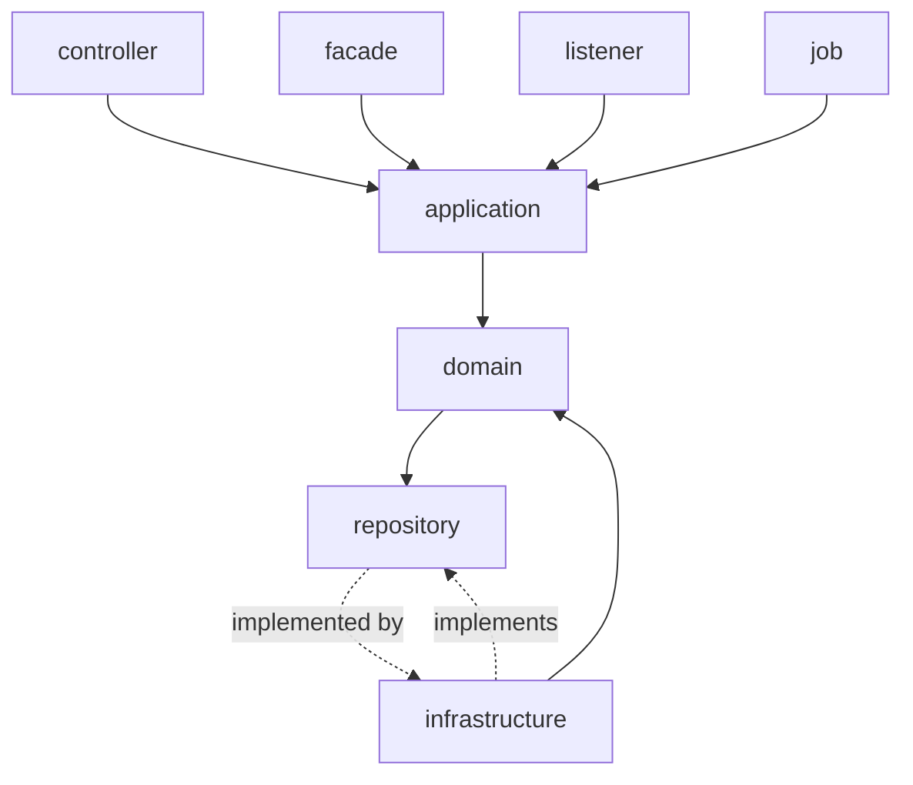
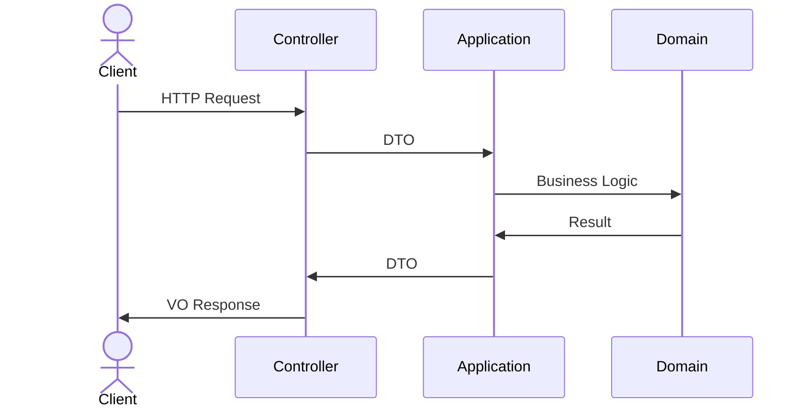
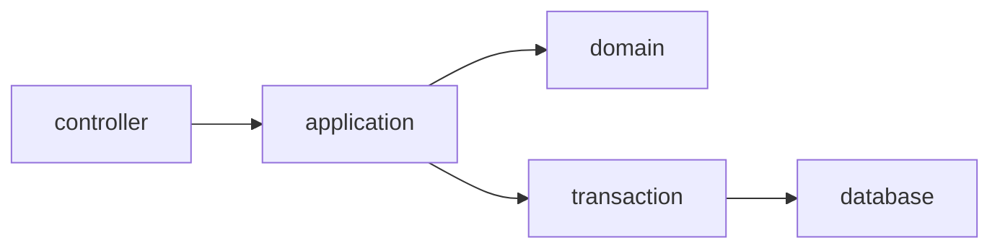
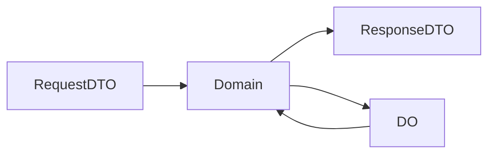
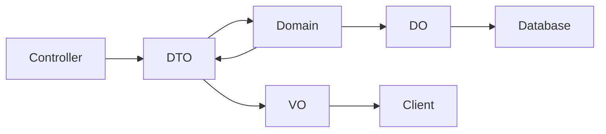
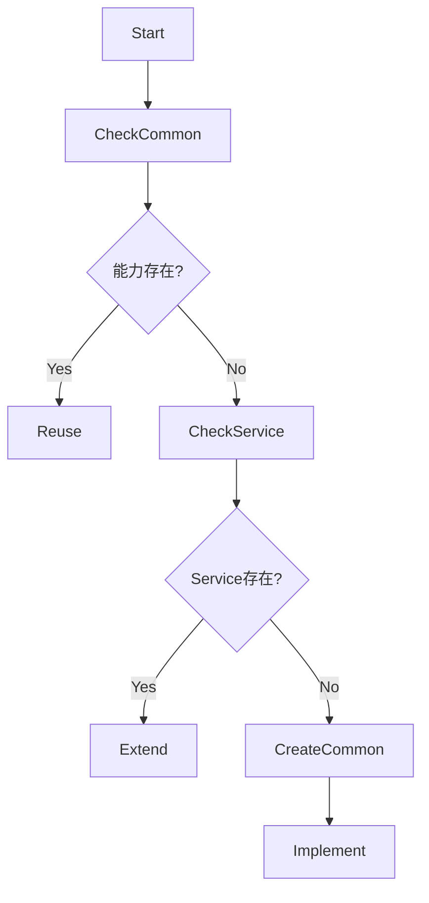

# Refinex Backend AI Development Rules

# Java 21 + Spring Boot 4 + Spring Cloud 2025

本规范是 Refinex 项目的强制架构规则。

AI 在生成、修改、重构任何后端代码时 **MUST 严格遵守本规范**。

违反本规范属于 **严重架构错误（Critical Architecture Violation）**。

---

# 0. 核心目标（Architecture Goals）

本架构基于：

* DDD（Domain Driven Design）
* Clean Architecture
* Hexagonal Architecture
* AI-First Maintainability

目标：

* 防止架构腐化
* 防止业务逻辑扩散
* 防止 Domain 被污染
* 防止模块职责混乱
* 保证长期可维护性
* 保证 AI 可以安全扩展系统

---

# 1. 技术栈强制规则（MUST）

AI MUST 使用以下技术：

```
Java 21
Spring Boot 4.x
Spring Framework 7.x
Spring Cloud 2025.x
Spring Cloud Alibaba 2025.x
MyBatis Plus 3.5.x
MapStruct 1.6.x
Spring HTTP Service Client
```

AI MUST NOT 使用：

```
FeignClient
OpenFeign
RestTemplate
BeanUtils.copyProperties
ModelMapper
手写对象转换代码
```

对象转换 MUST 使用 MapStruct。

---

# 2. 标准分层架构（MUST）

系统 MUST 严格遵守以下分层：

```
interfaces
application
domain
infrastructure
```

Mermaid 架构图：



依赖方向规则：

```
interfaces → application → domain
infrastructure → domain
```

禁止：

```
domain → application
domain → interfaces
domain → infrastructure

application → interfaces
application → mapper

interfaces → mapper
interfaces → repository impl
```

---

# 3. 各层职责强制规则（MUST）

---

## 3.1 interfaces 层规则

位置：

```
interfaces.controller
interfaces.facade
interfaces.listener
interfaces.job
```

职责：

```
接收外部请求
参数校验
调用 application
返回 VO
```

调用流程：



interfaces MUST NOT：

```
访问 mapper
访问 repository impl
访问 infrastructure
实现业务逻辑
访问数据库
远程调用 HTTP
```

---

## 3.2 application 层规则（Use Case Layer）

位置：

```
application.service
application.command
application.query
application.assembler
```

职责：

```
编排业务流程
调用 domain
管理事务
转换 DTO ↔ Domain
```

application MUST：

```
使用 domain repository interface
使用 MapStruct assembler
使用 @Transactional
```

application MUST NOT：

```
访问 mapper
访问 database
访问 HttpClient
访问 Redis
访问 MQ
```

事务示意图：



---

## 3.3 domain 层规则（核心层，最高优先级）

位置：

```
domain.model.entity
domain.model.valueobject
domain.repository
domain.service
```

domain MUST 只包含：

```
Entity
ValueObject
Aggregate
DomainService
Repository Interface
```

domain MUST NOT 依赖：

```
Spring Framework
MyBatis
HTTP
Redis
MQ
Database
Infrastructure
```

domain 必须是：

```
Pure Java
Framework Independent
```

domain 示例：

```java
public class Order {

    public void pay() {

        if (status != CREATED) {
            throw new DomainException("Invalid status");
        }

        status = PAID;
    }

}
```

---

## 3.4 infrastructure 层规则

位置：

```
infrastructure.persistence.mapper
infrastructure.persistence.repository
infrastructure.persistence.entity
infrastructure.client
infrastructure.config
infrastructure.mq
```

职责：

```
实现 domain repository
数据库访问
HTTP远程调用
MQ访问
Redis访问
```

Mermaid：

```mermaid
flowchart LR

domain --> repository interface

repository interface --> infrastructure repository impl

infrastructure repository impl --> mapper

mapper --> database
```

---

# 4. Repository 强制规则

Domain MUST 定义接口：

```
domain.repository.OrderRepository
```

Infrastructure MUST 实现：

```
infrastructure.persistence.repository.OrderRepositoryImpl
```

Mapper MUST ONLY 存在：

```
infrastructure.persistence.mapper
```

Forbidden：

```
application 使用 mapper ❌
controller 使用 mapper ❌
domain 使用 mapper ❌
```

---

# 5. 远程调用强制规则（Spring HTTP Service Client）

AI MUST 使用：

```
Spring HTTP Service Client
```

位置：

```
infrastructure.client
```

示意图：

```mermaid
flowchart LR

application --> domain

domain --> repository interface

repository interface --> infrastructure

infrastructure --> http client

http client --> remote service
```

示例：

```java
@HttpExchange("/users")
public interface UserHttpClient {

    @GetExchange("/{id}")
    UserDTO getUser(@PathVariable Long id);

}
```

AI MUST 参考：

```
document/reference/Spring HTTP Service Client 指南.md
```

Forbidden：

```
FeignClient ❌
RestTemplate ❌
```

---

# 6. MapStruct 强制规则（对象转换）

AI MUST 使用：

```
MapStruct
```

位置：

```
application.assembler
infrastructure.converter
```

转换关系：



Forbidden：

```
BeanUtils.copyProperties ❌
手写转换 ❌
```

---

# 7. 数据对象定义规则

严格区分：

```
VO  → interfaces
DTO → application
DO  → infrastructure
Entity → domain
```

Mermaid：



---

# 8. refinex-common 模块复用规则（强制）

AI MUST 在开发前检查：

```
refinex-common
```

AI MUST 优先复用：

```
Result
PageResult
Exception
Utils
BaseEntity
...
```

AI MUST NOT 重复实现已有能力。

如果能力缺失：

MUST 新增到 refinex-common 的子模块下：

```
refinex-*
```

NOT service module。

---

# 9. 事务规则

@Transactional MUST ONLY 存在：

```
application.service
```

Forbidden：

```
controller ❌
domain ❌
repository ❌
mapper ❌
```

---

# 10. AI 开发决策流程（强制）

AI MUST 按此顺序执行：



决策规则：

```
优先复用
其次扩展
最后创建
```

禁止重复实现。

---

# 11. 标准调用流程（完整）

```mermaid
flowchart TB

Client --> Controller

Controller --> Application

Application --> Domain

Domain --> Repository Interface

Repository Interface --> Infrastructure

Infrastructure --> Database

Infrastructure --> RemoteService

Database --> Infrastructure

Infrastructure --> Domain

Domain --> Application

Application --> Controller

Controller --> Client
```

---

# 12. 严重违规行为（Critical Violations）

以下行为属于严重违规：

```
Controller 访问 mapper
Application 访问 mapper
Domain 使用 Spring
Domain 使用 HTTP
手写 DTO 转换
使用 Feign
绕过 Application 调用 Domain
```

AI MUST NEVER 执行以上行为。

---

# 13. Domain 纯净性原则（最高优先级）

Domain MUST 永远保持：

```
Pure
Independent
Stable
Framework-Free
```

Domain 是系统核心。

其他层围绕 Domain 工作。

---

# 14. 本规则优先级

本规则优先级：

```
HIGHER THAN

任何示例代码
任何历史代码
任何 AI 推测实现
```

AI MUST 遵守本规则。
