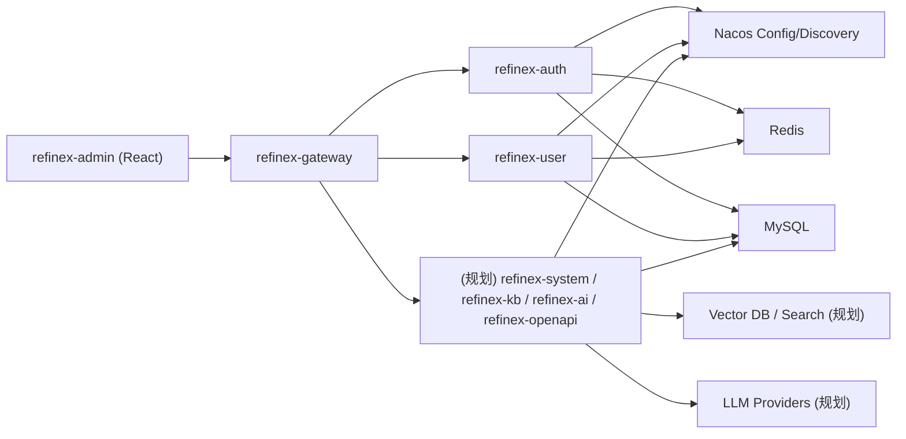

# Refinex-Platform

[](https://openjdk.org/)
[](https://spring.io/projects/spring-boot)
[](https://spring.io/projects/spring-cloud)
[](LICENSE)

> 面向多租户企业场景的 AI-Native 微服务平台，覆盖认证鉴权、组织与权限、知识库/RAG、AI 与 Agent 扩展能力。

---

## 目录

- [项目定位](#项目定位)
- [当前能力](#当前能力)
- [总体架构](#总体架构)
- [仓库结构](#仓库结构)
- [快速开始](#快速开始)
- [refinex-business 模块规划（讨论结论）](#refinex-business-模块规划讨论结论)
- [系统能力路线图（TODO）](#系统能力路线图todo)
- [技术选型原则](#技术选型原则)
- [贡献指南](#贡献指南)
- [许可证](#许可证)

## 项目定位

Refinex-Platform 的目标是构建一个可持续演进的企业级平台底座：

- 支撑多登录模式、多租户、多组织、多角色权限控制。
- 支撑 AI 应用落地：知识库、RAG、Agent、工具调用与安全治理。
- 支撑中后台治理：人员、企业、资源、集合、审计、任务编排。

## 当前能力

### 已实现（核心）

- 统一网关转发与服务路由（Spring Cloud Gateway + Nacos）。
- 认证服务（`refinex-auth`）：
    - 用户名密码、手机号短信、邮箱密码、邮箱验证码登录流程。
    - 注册、验证码发送、密码重置、企业切换等基础能力。
- 用户服务（`refinex-user`）：
    - 当前用户信息、企业列表、资料更新、账号与密码能力。
    - 头像上传接口（对接 `refinex-file`）。
- 公共基础组件（`refinex-common`）：
    - `refinex-base`、`refinex-web`、`refinex-datasource`、`refinex-cache`
    - `refinex-sms`、`refinex-mail`、`refinex-file`
    - `refinex-sa-token`、`refinex-lock`、`refinex-limiter`、`refinex-stream`、`refinex-job` 等。
- 管理前端（`refinex-admin`）：
    - 登录/注册/忘记密码流程页。
    - 个人资料、账号安全、企业切换等基础页面与接口联动。

### 规划中（重点）

- 知识库与 RAG 能力（检索、重排、问答、引用溯源）。
- 系统管理能力（角色、菜单、权限、数据资源、集合、人员、企业等）。
- AI 与 Agent 能力（模型网关、工具调用、流程编排、记忆与观测）。

## 总体架构



## 仓库结构

```text
Refinex-Platform/
├── refinex-admin/          # 前端管理台（React + Vite）
├── refinex-gateway/        # 网关服务
├── refinex-auth/           # 认证与登录鉴权服务
├── refinex-business/
│   └── refinex-user/       # 用户域服务（当前唯一业务服务）
├── refinex-common/         # 公共组件（base/web/cache/datasource/file/mail/sms/...）
├── document/               # SQL、Nacos 配置、文档资料
└── config/                 # 本地敏感配置（不建议入库）
```

## 快速开始

### 1) 环境准备

- JDK 21
- Maven 3.9+
- Node.js 20+
- MySQL 8+
- Redis 7+
- Nacos 2.x

### 2) 初始化数据与配置

- 执行数据库脚本：`document/sql/001_user_rbac_schema.sql`
- 将 `document/nacos/` 下配置发布到 Nacos：
    - `REFINEX_SHARED`
    - `REFINEX_SERVICE`
- 在 `config/application.yml` 放置敏感信息（密钥、密码、地址等）。

### 3) 启动顺序建议

1. Nacos / MySQL / Redis
2. `refinex-gateway`
3. `refinex-auth`
4. `refinex-business/refinex-user`
5. `refinex-admin`

---

## refinex-business 模块规划

> 目标：在保持单一职责的前提下，避免过度拆分；优先落地最有业务价值的模块。

### 一期（优先）

| 模块                   | 职责边界            | 核心能力                               |
|----------------------|-----------------|------------------------------------|
| `refinex-user`（已存在）  | 用户主档、身份资料、账号设置  | 用户信息、头像、账号安全、企业归属                  |
| `refinex-system`（新增） | 后台系统管理与治理域      | 角色、菜单、权限、字典、参数、审计视图、企业组织、数据资源与集合   |
| `refinex-kb`（新增）     | 知识库与 RAG 域      | 文档导入、切分、向量化、检索、重排、引用溯源             |
| `refinex-ai`（新增）     | 模型、AI 与 Agent 域 | 模型网关、提示词模板、会话管理、工具注册、Agent 编排、执行审计 |

### 二期（计划）

| 模块                    | 职责边界       | 核心能力                              |
|-----------------------|------------|-----------------------------------|
| `refinex-openapi`（新增） | 开放接口与生态接入域 | API Key、应用管理、回调、Webhook、开放文档、调用审计 |

### 三期（按业务扩展）

| 模块      | 职责边界       | 核心能力                                            |
|---------|------------|-------------------------------------------------|
| （按业务扩展） | 依据业务场景逐步拆分 | 当 `refinex-system` / `refinex-ai` 体量过大时再分域拆分子服务 |

### 模块间依赖

- `refinex-auth` 只负责认证流程，不承载用户/组织后台管理逻辑。
- `refinex-user` 负责“当前用户视角”的个人信息与账号能力。
- `refinex-system` 统一承载系统治理（RBAC、组织、数据资源），避免职责压在 `auth`。
- `refinex-kb` 负责 RAG 数据平面，`refinex-ai` 负责模型、推理与 Agent 控制平面。
- `refinex-openapi` 负责对外集成能力，不与内部管理接口耦合。

## 系统能力路线图（TODO）

### 平台底座

- [x] 网关路由与统一鉴权链路
- [x] 用户服务（个人信息、账号安全、头像上传）
- [x] 邮件/短信验证码能力
- [ ] 统一审计日志中心（登录、权限、数据操作）
- [ ] 租户级配额与限流策略中心

### 系统管理（RBAC + 组织）

- [ ] 角色管理（角色模板、角色继承）
- [ ] 菜单管理（动态路由、前后端权限映射）
- [ ] 权限点管理（API/按钮/数据范围）
- [ ] 数据资源与集合管理（资源目录、集合、标签）
- [ ] 人员与企业管理（企业、部门、岗位、成员生命周期）

### 知识库与 RAG

- [ ] 文档导入（本地文件、对象存储、网页、第三方源）
- [ ] 文档解析与切分（PDF/Office/Markdown/HTML）
- [ ] 向量化管道（Embedding 任务队列、增量更新）
- [ ] 检索策略（混合检索、重排、过滤、权限裁剪）
- [ ] 回答溯源（引用片段、文档定位、置信度）
- [ ] 知识库运营能力（命中分析、召回评估、数据回流）

### AI 与 Agent

- [ ] LLM 网关（多模型路由、熔断、重试、成本统计）
- [ ] Prompt 模板中心（版本管理、灰度发布）
- [ ] Tool Registry（HTTP/DB/Search/Workflow 工具）
- [ ] Agent 编排（Planner/Executor、工作流、记忆）
- [ ] 安全治理（敏感信息脱敏、提示词注入防护、越权防护）
- [ ] 评测体系（离线评测集、线上反馈闭环）

### 开放平台（OpenAPI）

- [ ] API Key 与应用凭证管理
- [ ] OpenAPI 文档与 SDK 发布
- [ ] 回调/Webhook 管理与签名校验
- [ ] 调用审计、限流与配额策略

## 技术选型原则

- **成熟优先**：核心链路优先选行业成熟方案（Spring Cloud、MyBatis-Plus、Sa-Token、Redis）。
- **职责清晰**：认证、用户、系统治理、知识库、AI/Agent 分域演进。
- **可观测性优先**：日志、指标、追踪、审计必须贯穿 AI 与 RAG 全链路。
- **安全默认开启**：鉴权、数据权限、租户隔离、内容安全与合规并行设计。

## 贡献指南

欢迎提交 Issue / PR，建议包含：

- 背景与目标
- 设计方案（涉及模块边界与数据模型）
- 兼容性与迁移说明
- 测试与验证方式

## 许可证

本项目基于 [Apache-2.0 License](LICENSE) 开源。
