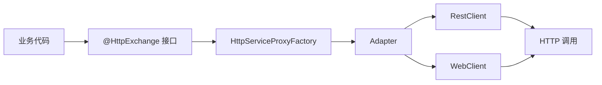

# Spring HTTP Service Client 指南

> 适用读者：已经在 Spring Boot / Spring Cloud 微服务中使用过 OpenFeign，希望在 Spring Framework 7 + Spring Boot 4 + Spring Cloud 2025.1 体系下升级客户端模型的开发者。
> 
> 
> 文档校准时间：2026-02-18。
> 

## 1. 背景与版本坐标

### 1.1 为什么这件事已经不是 “可选项”

`Spring Cloud OpenFeign` 在 Spring Cloud `2022.0.0`（2022-12-16）发布时被官方明确标记为 **feature-complete**，即后续以 bugfix 为主，不再作为主线演进方向。

与此同时，Spring 官方在 Spring Framework 6 开始提供 `@HttpExchange` 接口客户端能力，并在 Spring Framework 7 进入 “分组 + 注册表 + 自动装配” 的完整形态。

结论很直接：

1. 旧项目可以继续跑 OpenFeign，但新增能力会明显向 Interface Client 倾斜。
2. 新项目如果仍从 OpenFeign 起步，后续技术债几乎是确定会出现的。

### 1.2 关键时间线

| 日期 | 事件 | 影响 |
| --- | --- | --- |
| 2022-12-16 | Spring Cloud 2022.0.0 发布，并宣布 OpenFeign feature-complete | 迁移方向被官方明确 |
| 2025-11-13 | Spring Framework 7.0 GA | Interface Client / Registry 体系稳定 |
| 2025-11-20 | Spring Boot 4.0.0 GA | 提供 HTTP Service Client 自动配置 |
| 2025-11-25 | Spring Cloud 2025.1.0（Oakwood）GA | 提供 Interface Client 的 LB/CB 自动集成 |
| 2026-02-18 | 当前写作时点 | 推荐基线：Boot 4.0.2 + Cloud 2025.1.1 |

### 1.3 推荐版本组合

| 维度 | 推荐 |
| --- | --- |
| Java | 17+（生产建议 21/25） |
| Spring Framework | 7.0.x |
| Spring Boot | 4.0.x |
| Spring Cloud | 2025.1.x |

## 2. HTTP Service Client 的核心模型

### 2.1 不是 “换注解” 这么简单

HTTP Service Client 的本质是：

- 用接口定义远程契约（`@HttpExchange` + 方法级 `@GetExchange` 等）
- 用代理工厂把方法调用转为 HTTP 请求
- 把 “客户端能力（超时、拦截、负载均衡（LoadBalancer）、熔断）” 分层挂接在 Builder 与 Adapter 上

这意味着它不是 Feign 的语法替身，而是 Spring Web + Boot + Cloud 原生能力的统一入口。

### 2.2 关键组件关系



### 2.3 一个最小可运行接口

一个最简单的使用方式如下：

```java
package com.example.clients.user;

import org.springframework.web.bind.annotation.PathVariable;
import org.springframework.web.bind.annotation.RequestBody;
import org.springframework.web.service.annotation.GetExchange;
import org.springframework.web.service.annotation.HttpExchange;
import org.springframework.web.service.annotation.PostExchange;

// Interface Client：用 “接口 + 注解” 描述远程 HTTP API 契约
// - 这里不会真的发请求，只有当接口被注册为代理 Bean 后，调用方法才会触发 HTTP
// - 通常配合 @ImportHttpServices 注册到某个 group，并通过 spring.http.serviceclient.<group>.* 配置 base-url/超时/headers
@HttpExchange("/api/users") // 接口级统一前缀（相当于所有方法都默认带上 /api/users）
public interface UserServiceClient {

    // GET /api/users/{id}
    @GetExchange("/{id}")
    UserDTO getById(@PathVariable Long id); // @PathVariable 会被解析并替换到 {id}

    // POST /api/users
    @PostExchange
    UserDTO create(@RequestBody CreateUserCommand command); // @RequestBody 会序列化为请求体（通常 JSON）
}
```

### 2.4 关键注解与属性详解（@HttpExchange / @GetExchange 等）

很多资料会把 HTTP Service Client 简化成 “换一套注解”，但真正容易踩坑的点，往往来自**注解属性的默认值、继承与覆盖规则**。下面结合 `@HttpExchange` 以及一组方法级快捷注解（`@GetExchange` / `@PostExchange` / `@PutExchange` / `@PatchExchange` / `@DeleteExchange`）把关键属性讲清楚。

#### 2.4.1 `@HttpExchange` 是 “元注解”，其他 *Exchange 都是快捷包装

`@GetExchange` 等注解本质上是：

- 固定 `method`（比如 GET、POST）。
- 用 `@AliasFor(annotation = HttpExchange.class)` 把自身的属性“映射”为 `@HttpExchange` 的同名属性。

因此你可以把它们理解为：

- **`@HttpExchange`：通用协议描述器**（可用于类型级、方法级）。
- **`@GetExchange` 等：语义更清晰的语法糖**（仅方法级）。

#### 2.4.2 `value` 与 `url`：同义别名（Alias）

在 `@HttpExchange` 中：

- `value` 与 `url` 互为 `@AliasFor`，表示同一个属性。

使用建议：

1. 如果你只想写路径，直接写 `@HttpExchange("/api/users")` 或 `@GetExchange("/{id}")`，它落到的就是 `url`。
2. 不要在同一个注解里同时写 `value` 和 `url`，避免歧义（尽管别名机制会尝试合并，但可读性会下降）。

`url`/`value` 最终会与 group 级 `base-url` 进行拼接，形成真正的请求地址。

#### 2.4.3 `method`：请求方法从哪里来

- 在 `@HttpExchange` 中，`method` 默认是空字符串，表示 “不在这里指定”。
- 在 `@GetExchange` / `@PostExchange` 等中，通过 `@HttpExchange(method = "GET")` 这种方式把 `method` 固定住。

覆盖规则（从常见实践角度理解）：

1. **方法级优先于类型级**。
2. `@GetExchange` 明确指定了 GET，就不要再额外叠 `@HttpExchange(method=...)`，否则会变得难读。

#### 2.4.4 `contentType`：请求体的媒体类型（主要影响写请求）

`contentType` 等价于给请求设置 `Content-Type`。

- 常见值：`application/json`。
- 主要对 **带请求体的方法**（POST、PUT、PATCH）更重要。

经验法则：

1. 如果全接口都是 JSON，可放在**类型级**：`@HttpExchange(contentType = "application/json")`。
2. 如果同一接口有少量方法需要不同类型（例如 form 或 multipart），在**方法级**覆盖。

#### 2.4.5 `accept`：期望响应的媒体类型（主要影响读响应）

`accept` 对应 `Accept` header，用于声明客户端希望接收的响应类型。

- 常见值：`application/json`。
- 如果服务端会根据 `Accept` 做内容协商，这个字段就很关键。

建议：

1. 大多数内部服务可以不显式写（默认就能工作）。
2. 当你遇到“同一路径返回不同格式”或需要明确协商时，再写 `accept`。

#### 2.4.6 `headers`：静态 header 列表（适合常量，不适合动态鉴权）

`headers` 允许你声明一组静态 header（通常是 `"K=V"` 形式）。

但要注意边界：

- **不适合放动态 token**，因为 token 往往来自运行时上下文（登录态、租户、链路）。
- 动态 header 更适合用拦截器或 Filter（在第 6 章的 “鉴权透传 / trace 注入” 就是这类场景）。

所以通常推荐：

1. **常量 header**（例如版本常量、Caller 常量）可以写在注解或 YAML `default-headers`。
2. **动态 header**（token、trace、tenant）统一走拦截器。

#### 2.4.7 `version`：与 Boot 4 的 API Versioning 对齐

`version` 用于声明 “该方法或该接口调用的 API 版本”。它与第 4.2 节的 group 级 `apiversion.*` 能形成一个组合：

- group 级声明默认版本（未指定时使用）。
- 在特定方法上用 `version` 覆盖默认版本。

典型用法：

- 线上要灰度新版本 API，但只切一两个方法到新版本。

> 注意：具体 “版本插入到 header 还是 query parameter” 等由 `apiversion.insert.*` 决定；`version` 更像是 “版本号值” 本身。
> 

#### 2.4.8 一份 “放置位置” 速记（减少团队分歧）

1. **类型级 `@HttpExchange`**：放共同前缀、共同的 contentType/accept、共同 header（常量）。
2. **方法级 `@GetExchange` 等**：放该方法的路径、该方法的 version、以及少量特例 header。
3. **YAML / Group 配置**：放 base-url、超时、默认 header（常量）、版本插入策略。
4. **拦截器 / Configurer**：放鉴权、trace、租户等运行时动态逻辑。

## 3. 从 Framework 6 到 Framework 7：创建方式的演进

### 3.1 Spring Framework 6.x：手动工厂模式

Spring Framework 6.x 时代最常见写法是显式创建 `RestClient`、`Adapter`、`HttpServiceProxyFactory`。

```java
// Framework 6.x 常见的 “手动工厂模式”：显式创建 RestClient -> Adapter -> ProxyFactory，最后生成接口代理
@Configuration(proxyBeanMethods = false) // 关闭 @Bean 方法代理，减少启动期开销（配置类不需要通过方法调用来保证单例时推荐）
class LegacyHttpClientConfig {

    @Bean
    UserServiceClient userServiceClient() {
        // 1) 构造底层 HTTP 客户端（同步阻塞实现）。
        //    baseUrl 是该客户端的固定服务地址前缀，后续 @HttpExchange / @GetExchange 等会在此基础上拼接路径。
        //    比如我们上面的用户服务最终就会调用 https://user.example.com/api/users
        RestClient restClient = RestClient.builder()
                .baseUrl("<https://user.example.com>")
                .build();

        // 2) 把 RestClient 适配成 HttpServiceProxyFactory 可用的 ExchangeAdapter。
        //    这一层负责把 “接口方法调用” 转成 RestClient 的具体请求执行。
        RestClientAdapter adapter = RestClientAdapter.create(restClient);

        // 3) 构建代理工厂：它知道如何根据 @HttpExchange 等注解，为接口生成动态代理。
        HttpServiceProxyFactory factory = HttpServiceProxyFactory.builder()
                .exchangeAdapter(adapter)
                .build();

        // 4) 创建并返回接口代理 Bean。
        //    注入 UserServiceClient 并调用方法时，实际会触发 HTTP 请求。
        return factory.createClient(UserServiceClient.class);
    }
}
```

这个模式没有错，但在大型项目会遇到三类问题：

1. 接口多时配置重复，我们要为每个 Client 反复编写类似的样板代码。
2. 多环境和多服务分组难统一。
3. 团队约束难落地（某些客户端漏配置超时、鉴权、链路头）。

### 3.2 Spring Framework 7.x：Registry + Group

Spring Framework 7 引入 `@ImportHttpServices` 与 `HttpServiceProxyRegistry`，客户端可按 group 批量注册和管理。

```java
import org.springframework.web.service.registry.ImportHttpServices;

@SpringBootApplication
// Framework 7 的声明式注册：把某个包下的 @HttpExchange 接口批量注册到指定 group
// - group: 逻辑分组名（通常对齐 serviceId 或业务域），后续配置与治理都按 group 生效
// - basePackages: 要扫描的接口包路径
@ImportHttpServices(group = "user", basePackages = "com.example.clients.user")
@ImportHttpServices(group = "order", basePackages = "com.example.clients.order")
public class DemoApplication {

    public static void main(String[] args) {
        SpringApplication.run(DemoApplication.class, args);
    }
}
```

在注入侧，你可以直接注入接口，也可以注入 `HttpServiceProxyRegistry` 做按组动态获取。

```java
@Component
class ClientFacade {

    // 注册表：按 group 持有已注册的接口代理
    // 适合做 “运行时按 group/租户/区域切换 client” 的场景
    private final HttpServiceProxyRegistry registry;

    ClientFacade(HttpServiceProxyRegistry registry) {
        this.registry = registry;
    }

    UserServiceClient userClient() {
        // 从名为 "user" 的 group 中取出某个接口的代理实现
        // 前提：启动时已经通过 @ImportHttpServices(group="user", ...) 注册过该接口
        return registry.getClient("user", UserServiceClient.class);
    }
}
```

## 4. Spring Boot 4 的配置体系

大部分资料里最常见错误是把属性写成 `spring.http.client.service.*`。在 Boot 4 的官方文档中，应使用：

- 全局：`spring.http.clients.*`
- 分组：`spring.http.serviceclient.<group-name>.*`

### 4.1 全局与分组配置示例

```yaml
spring:
  http:
    # 全局默认配置（对所有 group 生效，可被 group 级配置覆盖）
    clients:
      connect-timeout: 2s     # 连接超时（建立 TCP/SSL 连接的时间上限）
      read-timeout: 5s        # 读超时（请求发出后等待响应数据的时间上限）
      redirects: dont-follow  # 是否跟随 30x 重定向（生产通常不建议默认跟随）

    # group 级配置：spring.http.serviceclient.<group-name>.*
    # <group-name> 需要与 @ImportHttpServices(group=...) 保持一致
    serviceclient:
      user:
        base-url: "<https://user.example.com>" # 固定地址调用（不会走 负载均衡（LoadBalancer））
        read-timeout: 2s                       # 覆盖全局 read-timeout
        default-headers:                       # 默认请求头（会自动加到每个请求）
          X-Caller: "gateway"

      order:
        base-url: "<https://order.example.com>"
        connect-timeout: 1s                    # 覆盖全局 connect-timeout
```

### 4.2 API Versioning（客户端侧）

HTTP Service Client 可以在 group 级别声明版本插入策略。

```yaml
spring:
  http:
    serviceclient:
      user:
        apiversion:
          default: "2026-01"         # 未显式传版本时使用的默认版本
          insert:
            header: "X-API-Version"  # 版本注入位置：写入到指定 header
```

### 4.3 编程式增强：组配置器

当 YAML 不够表达复杂逻辑（动态鉴权、分组策略、Builder 细节）时，使用 `RestClientHttpServiceGroupConfigurer`。

```java
import org.springframework.web.client.support.RestClientHttpServiceGroupConfigurer;

@Configuration(proxyBeanMethods = false) // 关闭 @Bean 方法代理，减少启动期开销（配置类不需要通过方法调用来保证单例时推荐）
class GroupCustomizerConfig {

    @Bean
    RestClientHttpServiceGroupConfigurer commonHeadersConfigurer() {
        // 编程式增强：对每个 group 的 RestClient Builder 做统一定制
        // 典型用途：动态鉴权、按 group 注入公共 header、灰度开关等（YAML 不易表达的逻辑）
        return groups -> groups.forEachClient((group, builder) -> {
            // 为每个 group 的所有请求加一个标识 header
            builder.defaultHeader("X-Service-Group", group.name());
        });
    }
}
```

## 5. Spring Cloud 2025.1 集成：负载均衡与熔断

Spring Cloud 2025.1.x 为 Interface Client 提供了自动化集成，但触发条件有细节，实际项目很容易踩坑。

### 5.1 LoadBalancer 集成触发条件

Spring Cloud 文档中的关键行为：

1. 当 `spring.http.serviceclient.<group>.base-url` 未配置时，会按 group 名推断 serviceId。
2. 当 `base-url` 使用 `lb://` scheme 时，会启用基于 serviceId 的负载均衡。
3. 当 `base-url` 是普通 `http://` 或 `https://` 固定地址时，不会走 负载均衡（LoadBalancer） 选择器。

示例：

```yaml
spring:
  http:
    serviceclient:
      user-service:
        base-url: "lb://user-service" # 使用 LB scheme：交给 Spring Cloud LoadBalancer 选择实例
```

> 生产建议：团队统一约定 “内部服务一律 `lb://`，外部第三方一律 `https://`”，避免调用路径语义混乱。
> 

### 5.2 LoadBalancer 细化配置

```yaml
spring:
  cloud:
    loadbalancer:
      enabled: true          # 总开关，是否开启负载均衡

      retry:
        enabled: true        # 是否启用负载均衡层重试（注意与业务幂等性匹配）

      clients:
        user-service:
          health-check:
            interval: 10s    # 健康检查间隔（不同实现/版本支持项可能略有差异）
```

如需按服务定制策略，可用 `@LoadBalancerClient` 提供自定义 `ReactorLoadBalancer<ServiceInstance>`。

### 5.3 CircuitBreaker 与 Fallback

Spring Cloud 2025.1.x 提供：

- `CircuitBreakerRestClientHttpServiceGroupConfigurer`
- `CircuitBreakerWebClientHttpServiceGroupConfigurer`

并支持通过 `@HttpServiceFallback` 声明降级实现。

```java
import org.springframework.cloud.client.circuitbreaker.HttpServiceFallback;
import org.springframework.cloud.client.circuitbreaker.CircuitBreakerFactory;
import org.springframework.cloud.client.circuitbreaker.HttpServiceCircuitBreakerAutoConfiguration;

// 声明：当 user-service 这个 group 上的 UserServiceClient 调用发生故障时，允许使用 UserFallback 做降级
@HttpServiceFallback(value = UserFallback.class, service = UserServiceClient.class, group = "user-service")
@Configuration(proxyBeanMethods = false) // 关闭 @Bean 方法代理，减少启动期开销（配置类不需要通过方法调用来保证单例时推荐）
class UserClientCircuitBreakerConfig {

    @Bean
    CircuitBreakerRestClientHttpServiceGroupConfigurer circuitBreakerConfigurer(CircuitBreakerFactory<?, ?> factory) {
        // 把 CircuitBreaker 能力挂接到 RestClient 体系的 group 构建流程中
        // 前提：工程中引入了 spring-cloud-starter-circuitbreaker-* 对应实现（如 resilience4j）
        return new CircuitBreakerRestClientHttpServiceGroupConfigurer(factory);
    }
}

// 降级实现类：方法签名需要与接口方法匹配（通常额外带一个 Throwable cause）
public class UserFallback {

    public UserDTO getById(Long id, Throwable cause) {
        // 注意：这里返回的对象最好带 “降级标记”，便于上游识别与监控统计
        return new UserDTO(id, "fallback-user");
    }
}
```

> 版本提示：部分早期样例使用 `forService` / `forGroup` 命名。请以你项目当前 `spring-cloud-circuitbreaker` 版本 Javadoc 为准。
> 

### 5.4 关闭 CB 集成（排障时有用）

```yaml
spring:
  cloud:
    circuitbreaker:
      http-services:
        enabled: false          # 关闭阻塞式（RestClient）HTTP Service Client 的 CB 挂接
      reactive-http-services:
        enabled: false          # 关闭响应式（WebClient）HTTP Service Client 的 CB 挂接
```

## 6. 企业级实践：从 “可调用” 到 “可运维”

### 6.1 统一鉴权透传（阻塞链路）

在企业内部调用中，最常见的 “鉴权透传” 需求是：上游请求已完成登录认证，下游服务的 HTTP 调用需要自动带上当前用户或当前请求的 token（通常是 `Authorization: Bearer <token>`），从而让下游能继续做权限校验与审计。

阻塞式链路（Servlet / `RestClient`）的上下文通常绑定在当前线程上，因此最直接的做法是实现 `ClientHttpRequestInterceptor`：在发起请求前从 `SecurityContextHolder`（或你们的 RequestContext/ThreadLocal）取出 token，然后写入请求头。

下面示例演示两件事：

1. 一个拦截器 `AuthTokenInterceptor`，只负责 “从上下文取 token 并注入 header”。
2. 一个 `RestClientHttpServiceGroupConfigurer`，负责把拦截器统一挂到指定 group（例如 `*-service`）上，从而把 “哪些客户端需要透传” 变成集中规则。

```java
@Component
class AuthTokenInterceptor implements ClientHttpRequestInterceptor {

    @Override
    public ClientHttpResponse intercept(HttpRequest request, byte[] body, ClientHttpRequestExecution execution) throws IOException {
        // 1) 从 SecurityContext 获取当前请求的认证信息（示例：把 credentials 当作 token）。
        //    实际项目里通常会从自定义 Authentication / ThreadLocal / RequestContext 中取。
        String token = SecurityContextHolder.getContext().getAuthentication() == null
                ? null
                : (String) SecurityContextHolder.getContext().getAuthentication().getCredentials();

        // 2) 有 token 则注入到下游请求头：Authorization: Bearer <token>
        if (token != null && !token.isBlank()) {
            request.getHeaders().setBearerAuth(token);
        }

        // 3) 继续执行请求链
        return execution.execute(request, body);
    }
}

@Configuration(proxyBeanMethods = false)
class AuthHeaderConfig {

    @Bean
    RestClientHttpServiceGroupConfigurer authHeaderGroupConfigurer(AuthTokenInterceptor interceptor) {
        // 按 group 名过滤：这里只对 *-service 结尾的 group 应用鉴权拦截器
        // 好处：把 “哪些客户端需要透传鉴权” 做成集中规则
        return groups -> groups.filterByName(name -> name.endsWith("-service"))
                // 对每个匹配的 group，给其底层 RestClient Builder 加 requestInterceptor
                .forEachClient((name, builder) -> builder.requestInterceptornterceptor));
    }
}
```

### 6.2 响应式上下文透传（WebClient）

响应式链路（WebFlux / `WebClient`）不应依赖 `ThreadLocal`，因为请求可能在不同线程间切换执行。更稳妥的做法是把 token 放入 Reactor `Context`，并在 `ExchangeFilterFunction` 中读取后写入请求头。

下面示例用 `Mono.deferContextual` 从 Context 读取 `token`，然后基于原始 `ClientRequest` 复制一份新请求并追加 `Authorization` header。

```java
@Component
class ReactiveTokenFilter implements ExchangeFilterFunction {

    @Override
    public Mono<ClientResponse> filter(ClientRequest request, ExchangeFunction next) {
        // 响应式链路不要依赖 ThreadLocal（可能跨线程执行）。
        // 这里演示从 Reactor Context 取 token，然后注入到请求头。
        return Mono.deferContextual(ctx -> {
            String token = ctx.getOrDefault("token", "");

            // 基于原始 request 复制一份新 request，并追加 Authorization header
            ClientRequest newRequest = ClientRequest.from(request)
                    .headers(headers -> {
                        if (!token.isBlank()) {
                            headers.setBearerAuth(token);
                        }
                    })
                    .build();

            return next.exchange(newRequest);
        });
    }
}
```

### 6.3 链路追踪头统一注入

为了让调用链可观测（日志关联、分布式追踪、跨服务排障），通常需要把 `traceId`（以及可能的 `spanId`、`baggage`、`tenantId` 等）在服务间透传。客户端侧最常见实现仍然是拦截器：在每次发起下游请求时，把当前上下文中的 trace 信息写入到约定的请求头。

阻塞式示例里这里用 `MDC` 读取 `traceId`。需要注意的是：`MDC` 同样是 `ThreadLocal` 模型，如果存在异步线程切换，需要配套的上下文传递方案，避免 trace 断链。

```java
@Component
class TraceHeaderInterceptor implements ClientHttpRequestInterceptor {

    @Override
    public ClientHttpResponse intercept(HttpRequest request, byte[] body, ClientHttpRequestExecution execution) throws IOException {
        // 从日志 MDC 中读取 traceId，并透传到下游请求头。
        // 注意：MDC 也是 ThreadLocal 模型，异步/线程切换时需要额外的上下文传递方案。
        String traceId = MDC.get("traceId");

        if (traceId != null && !traceId.isBlank()) {
            request.getHeaders().add("X-Trace-Id", traceId);
        }

        return execution.execute(request, body);
    }
}
```

### 6.4 错误语义统一：把 HTTP 错误映射成业务异常

“可运维” 的关键之一是：上游不要直接面对杂乱的 HTTP 状态码与原始响应体，而是得到**稳定且可分类**的领域异常。这样才能在上游统一做告警、重试、兜底与埋点统计。

阻塞式链路下，可以通过实现 `ResponseErrorHandler` 来定义：

- 哪些状态码算错误（`hasError`）。
- 遇到错误时如何读取响应、并映射成具体业务异常（`handleError`）。

下面示例按 404 与 5xx 做了最基本的分类映射，你可以把它扩展为更细的错误码体系（例如把下游的错误码字段解析出来，映射到统一的 ErrorCode）。

```java
@Component
class DomainErrorHandler implements ResponseErrorHandler {

    @Override
    public boolean hasError(ClientHttpResponse response) throws IOException {
        // 决定哪些响应状态码会被视为 “错误”，从而触发 handleError
        HttpStatusCode code = response.getStatusCode();
        return code.is4xxClientError() || code.is5xxServerError();
    }

    @Override
    public void handleError(ClientHttpResponse response) throws IOException {
        // 读取响应体用于诊断（注意：生产中要控制 body 大小与敏感信息泄露）
        String body = StreamUtils.copyToString(response.getBody(), StandardCharsets.UTF_8);
        int code = response.getStatusCode().value();

        // 按状态码映射为领域异常：便于上游做不同的兜底/重试/告警策略
        if (code == 404) {
            throw new UserNotFoundException(body);
        }
        if (code >= 500) {
            throw new RemoteSystemException(body);
        }
        throw new RemoteCallException(body);
    }
}
```

> 设计建议：不要把所有 4xx/5xx 都简单包装成 RuntimeException。异常分类是可观测性与重试策略设计的前提。
> 

### 6.5 重试策略

Spring Cloud 已提供 CircuitBreaker 层能力；“重试” 建议与幂等性绑定：

1. 只对 GET、幂等 PUT、可安全重放请求开启自动重试。
2. 非幂等写操作（POST 创建）优先走业务补偿，不建议盲重试。
3. 配合退避策略，避免雪崩。

Resilience4j 示例：

```yaml
resilience4j:
  circuitbreaker:
    instances:
      user-service:                       # 实例名通常对齐 serviceId 或 group（团队统一即可）
        sliding-window-size: 20           # 统计窗口大小（最近 N 次调用）
        minimum-number-of-calls: 10       # 少于 N 次调用时不计算失败率，避免冷启动误判
        failure-rate-threshold: 50        # 失败率阈值（百分比），超过则打开熔断
        wait-duration-in-open-state: 10s  # 熔断打开后保持时间
```

## 7. 性能与容量：别把 “客户端选择” 当玄学

### 7.1 三种底层的选型建议

| 场景 | 推荐 |
| --- | --- |
| 传统阻塞业务、调用链短 | `RestClient` |
| 高并发 IO、响应式链路 | `WebClient` |
| 兼容遗留代码（临时） | `RestTemplate` |

### 7.2 影响吞吐的不是注解，而是这几项

1. 连接池参数（max total / per route）
2. 读写超时是否按服务分级
3. 是否错误地把大响应读入内存
4. 是否把日志拦截器开到了全量 body（生产经常是隐形瓶颈）

### 7.3 连接池配置（Apache HttpClient 5）

在阻塞式客户端（`RestClient`）场景里，连接池是吞吐与稳定性的关键变量之一：

- 连接数不足会导致请求排队、P99 拉高。
- 连接数过大或缺少回收策略会造成资源占用和连接泄漏风险。

下面示例用 Apache HttpClient 5 构建一个带连接池的 `CloseableHttpClient`，并把它注入到 `HttpComponentsClientHttpRequestFactory`，再通过 `RestClientCustomizer` 让全局 `RestClient` 默认使用该 requestFactory。

如果你希望 “按 group/按服务” 分别配置连接池，需要把这段配置下沉到 group 级 builder（例如在 `RestClientHttpServiceGroupConfigurer` 中为不同 group 提供不同的 requestFactory）。

```java
@Configuration(proxyBeanMethods = false)
class HttpPoolConfig {

    @Bean
    HttpComponentsClientHttpRequestFactory requestFactory() {
        // 1) 连接池管理器：复用 TCP 连接，避免频繁建连导致吞吐下降
        PoolingHttpClientConnectionManager manager = new PoolingHttpClientConnectionManager();
        manager.setMaxTotal(300);          // 整体最大连接数
        manager.setDefaultMaxPerRoute(50); // 单个目标地址（route）的最大连接数

        // 2) 构建 Apache HttpClient 5，并绑定连接池
        CloseableHttpClient client = HttpClients.custom()
                .setConnectionManager(manager)
                .evictExpiredConnections() // 清理过期连接
                .build();

        // 3) 把 HttpClient 注入到 Spring 的 ClientHttpRequestFactory
        return new HttpComponentsClientHttpRequestFactory(client);
    }

    @Bean
    RestClientCustomizer restClientCustomizer(HttpComponentsClientHttpRequestFactory requestFactory) {
        // 4) 让 RestClient 默认使用上面的 requestFactory，从而统一连接池配置
        return builder -> builder.requestFactory(requestFactory);
    }
}
```

### 7.4 大响应场景（WebClient）

```yaml
spring:
  codec:
    max-in-memory-size: 16MB  # WebClient 解码响应体时的内存上限（大响应建议改成流式处理）
```

> 如果响应可能超过内存阈值，优先改成流式处理，不要单纯继续放大内存。
> 

## 8. 常见问题与排查手册

### 8.1 `No qualifying bean`（接口代理未注册）

排查顺序：

1. 是否添加了 `@ImportHttpServices`。
2. `basePackages` 是否扫描到接口。
3. 接口是否包含 `@HttpExchange`（类型级或方法级）。
4. 依赖是否在 Boot/Cloud BOM 管理下（避免版本错配）。

### 8.2 `URI is not absolute`

高频原因：

1. group 未配置 `base-url`，且未走 `lb://`。
2. 写了 `user-service/api` 这种无 scheme 且非 LB 语义地址。

### 8.3 Fallback 不生效

高频原因：

1. Fallback 类或方法不是 `public`。
2. Fallback 方法签名不匹配（参数顺序/类型不一致）。
3. 配置了 `service/group` 但与实际 group 名不一致。
4. 手动关闭了 `spring.cloud.circuitbreaker.http-services.enabled`。

### 8.4 循环依赖

规避策略：

1. 客户端配置类尽量纯配置，不注入业务服务。
2. 必要时使用 `ObjectProvider<T>` 或 `@Lazy`。
3. 把 “调用逻辑” 与 “客户端装配” 拆分到不同配置层。

## 9. 从 OpenFeign 到 HTTP Service Client 的迁移

### 9.1 注解语义映射

| OpenFeign | HTTP Service Client |
| --- | --- |
| `@FeignClient(name=...)` | `@ImportHttpServices(group=...)` + `@HttpExchange` |
| `@GetMapping` | `@GetExchange` |
| `@PostMapping` | `@PostExchange` |
| `fallback/fallbackFactory` | `@HttpServiceFallback` |

### 9.2 分阶段迁移（推荐）

1. 基线校准：先把 Boot/Cloud 升到目标版本，保证 BOM 一致。
2. 双轨并行：新增 Interface Client，不立即删除 Feign。
3. 入口切换：在 Facade 层做灰度切换（按流量或按租户）。
4. 稳定观察：观察 1-2 个发布周期的错误率和时延。
5. 清理收尾：移除 Feign 依赖与配置。

### 9.3 代码迁移示例

OpenFeign：

```java
// 旧：OpenFeign 客户端
// - name: serviceId（配合服务发现/LB）
// - url: 固定地址（常见于直连或外部服务）
@FeignClient(name = "user-service", url = "${services.user.url}")
public interface UserFeignClient {

    // Feign 复用 Spring MVC 注解描述请求
    @GetMapping("/api/users/{id}")
    UserDTO getUser(@PathVariable("id") Long id);
}
```

Interface Client：

```java
// 新：HTTP Service Client（Interface Client）
// - 用 @HttpExchange 定义接口级前缀
// - 方法级用 @GetExchange / @PostExchange 等描述请求
@HttpExchange("/api/users")
public interface UserServiceClient {

    @GetExchange("/{id}")
    UserDTO getUser(@PathVariable Long id);
}

@Configuration(proxyBeanMethods = false)
// 把该接口注册到 "user-service" 这个 group
// 后续用 spring.http.serviceclient.user-service.* 做该 group 的统一配置
@ImportHttpServices(group = "user-service", types = UserServiceClient.class)
class UserClientConfig {
}
```

配置迁移：

```yaml
# old: spring.cloud.openfeign.client.config.user-service.url
spring:
  http:
    serviceclient:
      user-service:
        base-url: "lb://user-service" # 从 Feign 的 url 配置迁移为 group 的 base-url（并切到 LB 语义）
```

### 9.4 依赖迁移建议

移除：

```xml
<!-- 移除 OpenFeign 依赖：不再新增 Feign 客户端时，避免继续引入其专属配置体系与运行时开销 -->
<dependency>
  <groupId>org.springframework.cloud</groupId>
  <artifactId>spring-cloud-starter-openfeign</artifactId>
</dependency>
```

保留/新增：

```xml
<!-- 保留/新增（示例）：按需选择。具体依赖以你的工程类型（Servlet/WebFlux）与治理需求为准 -->

<!-- 提供 Spring MVC / RestClient 等（阻塞式链路常见选择） -->
<dependency>
  <groupId>org.springframework.boot</groupId>
  <artifactId>spring-boot-starter-web</artifactId>
</dependency>

<!-- 若 base-url 使用 lb:// 或希望接入服务发现 + 负载均衡，则需要 LoadBalancer -->
<dependency>
  <groupId>org.springframework.cloud</groupId>
  <artifactId>spring-cloud-starter-loadbalancer</artifactId>
</dependency>

<!-- 若希望在 Interface Client 上启用熔断与 fallback（示例用 resilience4j 实现），则引入对应 starter -->
<dependency>
  <groupId>org.springframework.cloud</groupId>
  <artifactId>spring-cloud-starter-circuitbreaker-resilience4j</artifactId>
</dependency>
```

## 10. 生产落地清单（可直接用于 CR 模板）

### 10.1 配置清单

1. 每个内部 group 必须声明 `lb://` 或明确固定 URL。
2. 每个 group 必须声明读超时，关键链路单独调优。
3. 统一默认 header：调用方、trace-id、tenant-id。
4. 熔断阈值按服务分层，不用“一刀切默认值”。

### 10.2 代码清单

1. 禁止在 `@Configuration` 中写业务调用。
2. 禁止在拦截器中记录全量敏感信息。
3. Fallback 返回值必须可被上游识别（含降级标记字段）。
4. 所有客户端接口都应有契约测试或 WireMock 集成测试。

### 10.3 监控清单

1. 按 group 统计成功率、P95、P99。
2. 统计 fallback 命中率与原因分类。
3. 把 LB 选实例结果打入 debug 日志（可按开关启用）。
4. 对“重试 + 熔断”组合设置告警阈值，防止放大故障。

## 11. 结论

HTTP Service Client 的价值不在 “少写几个注解”，而在于：

1. 把 HTTP 调用能力与 Spring 主干能力合并为一个一致模型。
2. 通过 group 维度让配置、治理、观测可规模化。
3. 在 Spring Cloud 2025.1 后，LB/CB 集成从 “可做” 变成 “默认可用”。

如果你的团队已经计划升级到 Boot 4 / Cloud 2025.1，这条迁移路径应该尽早进入路线图，而不是等 OpenFeign 相关痛点集中爆发再处理。

## 12. 参考资料（官方）

1. Spring Boot Reference - Calling REST Services / HTTP Service Interface Clients[https://docs.spring.io/spring-boot/reference/io/rest-client.html](https://docs.spring.io/spring-boot/reference/io/rest-client.html)
2. Spring Framework 7 Javadoc - `ImportHttpServices` / `HttpServiceProxyRegistry`[https://docs.spring.io/spring-framework/docs/current/javadoc-api/org/springframework/web/service/registry/ImportHttpServices.html](https://docs.spring.io/spring-framework/docs/current/javadoc-api/org/springframework/web/service/registry/ImportHttpServices.html)
3. Spring Cloud Commons Reference - LoadBalancer（含 Interface Client 集成）[https://docs.spring.io/spring-cloud-commons/reference/spring-cloud-commons/loadbalancer.html](https://docs.spring.io/spring-cloud-commons/reference/spring-cloud-commons/loadbalancer.html)
4. Spring Cloud Commons Reference - Circuit Breaker（含 `@HttpServiceFallback`）[https://docs.spring.io/spring-cloud-commons/reference/spring-cloud-circuitbreaker.html](https://docs.spring.io/spring-cloud-commons/reference/spring-cloud-circuitbreaker.html)
5. Spring Cloud OpenFeign Reference（feature-complete 声明）[https://docs.spring.io/spring-cloud-openfeign/reference/index.html](https://docs.spring.io/spring-cloud-openfeign/reference/index.html)
6. Spring Cloud 2022.0.0 发布说明（2022-12-16）[https://spring.io/blog/2022/12/16/spring-cloud-2022-0-0-codename-kilburn-has-been-released](https://spring.io/blog/2022/12/16/spring-cloud-2022-0-0-codename-kilburn-has-been-released)
7. Spring Framework 7.0 GA（2025-11-13）[https://spring.io/blog/category/releases/page-7](https://spring.io/blog/category/releases/page-7)
8. Spring Boot 4.0.0 GA（2025-11-20）[https://spring.io/blog/2025/11/20/spring-boot-4-0-0-available-now/](https://spring.io/blog/2025/11/20/spring-boot-4-0-0-available-now/)
9. Spring Cloud 2025.1.0 GA（2025-11-25）[https://spring.io/blog/2025/11/25/spring-cloud-2025-1-0-aka-oakwood-has-been-released](https://spring.io/blog/2025/11/25/spring-cloud-2025-1-0-aka-oakwood-has-been-released)

## 13. Registry 深度解析：声明式之外的控制面

### 13.1 两种注册方式

### 方式 A：包扫描

```java
// 方式 A：包扫描注册
// 适用：接口数量多，按包分组清晰
// 注意：basePackages 要尽量收敛，避免把不该注册的接口扫进来
@ImportHttpServices(group = "billing", basePackages = "com.example.clients.billing")
@Configuration(proxyBeanMethods = false)
class BillingClientConfig {
}
```

特点：

1. 适合接口数量多、按包组织清晰的项目。
2. 改动最少，新增接口基本无需改配置。
3. 风险是误扫非预期接口（建议固定包边界）。

### 方式 B：显式类型声明

```java
// 方式 B：显式类型注册
// 适用：强约束场景（希望 “注册清单” 可审计、可 Code Review）
// 注意：新增接口需要同步更新 types 列表，否则不会生成代理 Bean
@ImportHttpServices(
        group = "billing",
        types = {InvoiceClient.class, PaymentClient.class}
)
@Configuration(proxyBeanMethods = false)
class BillingExplicitConfig {
}
```

特点：

1. 适合强约束场景（金融、支付、审计系统）。
2. 配置审查更清晰，CR 可追溯性高。
3. 维护成本稍高（新增接口需同步改配置）。

### 13.2 组配置优先级

推荐统一规则（减少团队歧义）：

1. 底层默认值：`spring.http.clients.*`
2. 组级覆盖：`spring.http.serviceclient.<group>.*`
3. 编程式覆盖：`HttpServiceGroupConfigurer`

示意：

```
全局默认 < group 配置 < 编程式配置
```

如果同一项被多处定义，以最后应用的 Builder 配置为准。建议团队约定 “YAML 负责静态项，Configurer 只负责动态项”。

### 13.3 多租户分组策略

当一个下游服务存在多租户入口时，不建议通过运行时字符串拼 URL，建议按 group 固化。

```yaml
spring:
  http:
    serviceclient:
      # 多 region / 多租户入口时，推荐用多个 group 固化不同 base-url，避免运行时拼 URL
      user-cn:
        base-url: "<https://cn.user.example.com>"
      user-us:
        base-url: "<https://us.user.example.com>"
```

```java
@Component
class MultiRegionUserClient {

    private final HttpServiceProxyRegistry registry;

    MultiRegionUserClient(HttpServiceProxyRegistry registry) {
        this.registry = registry;
    }

    UserServiceClient byRegion(String region) {
        // 1) 运行时把 region 映射为 group 名
        //    group 名需要与 spring.http.serviceclient.<group>.base-url 的 <group> 对齐
        String group = switch (region) {
            case "CN" -> "user-cn";
            case "US" -> "user-us";
            default -> throw new IllegalArgumentException("Unsupported region: " + region);
        };

        // 2) 从注册表按 group 获取对应的接口代理
        //    这样可以做到“同一个接口，不同 region 走不同 base-url/LB 语义/超时策略”
        return registry.getClient(group, UserServiceClient.class);
    }
}
```

## 14. OpenFeign vs HTTP Service Client

### 14.1 不是 “新旧 API”，而是 “治理模型” 差异

| 对比维度 | OpenFeign | HTTP Service Client |
| --- | --- | --- |
| 生态定位 | Cloud 子项目集成 | Framework + Boot + Cloud 主线能力 |
| 依赖关系 | 需要 starter + 额外配置 | Boot 4 中与 REST Client 体系统一 |
| 配置模型 | Feign 专属配置体系 | `spring.http.clients` + `spring.http.serviceclient` |
| 负载均衡集成 | 可用 | 在 2025.1 对 Interface Client 做了原生联动 |
| 熔断集成 | 可用 | 与 `@HttpServiceFallback` 直接衔接 |
| API 版本注入 | 通常需自定义 | Boot 4 提供 `apiversion.insert.*` |
| 长期演进 | feature-complete | 主线演进中 |

### 14.2 典型转换片段

OpenFeign：

```java
// 旧：OpenFeign 客户端（另一种常见写法）
// - name: serviceId
// - path: 统一前缀（等价于在每个方法上都写 /api/inventory）
@FeignClient(name = "inventory-service", path = "/api/inventory")
public interface InventoryFeignClient {

    // Feign 仍然复用 Spring MVC 注解
    @GetMapping("/{sku}")
    InventoryDTO getBySku(@PathVariable("sku") String sku);
}
```

HTTP Service Client：

```java
// Interface Client（示例：库存服务）
@HttpExchange("/api/inventory") // 接口级前缀
public interface InventoryServiceClient {

    // GET /api/inventory/{sku}
    @GetExchange("/{sku}")
    InventoryDTO getBySku(@PathVariable String sku);
}

@Configuration(proxyBeanMethods = false)
// 显式注册到 inventory-service 组
// 好处：配置、超时、LB/CB、header 注入等都可以按 group 做统一治理
@ImportHttpServices(group = "inventory-service", types = InventoryServiceClient.class)
class InventoryClientRegistration {
}
```

### 14.3 迁移成本评估表

| 项目状态 | 建议 |
| --- | --- |
| Boot 2.x / Cloud Hoxton 及更早 | 先升级技术栈，再迁移客户端 |
| Boot 3.x / Cloud 2023.x | 可做双轨迁移，风险可控 |
| Boot 4.x / Cloud 2025.1.x | 直接新建 Interface Client，不再新增 Feign |

### 14.4 基准测试方法建议（避免误判）

不要只测 “空 GET + 本地回环”。推荐至少覆盖：

1. 50% GET + 50% POST（含 JSON 序列化）。
2. 5KB / 100KB / 1MB 三档响应体。
3. 固定连接池与超时参数。
4. 分别测试 “固定 URL” 与 “LB URL”。

可执行模板：

```
# 压测模板（建议写进团队统一的 benchmark 文档/脚本参数）
- 并发：200, 500, 1000
- 时长：每轮 5 分钟，预热 2 分钟
- 指标：吞吐、P95/P99、错误率、GC 停顿
```

## 15. 测试体系：把风险前置到 CI

### 15.1 接口契约测试（WireMock）

```java
@SpringBootTest
@AutoConfigureWireMock(port = 0) // 启动一个随机端口的 WireMock，避免端口冲突
class UserClientContractTest {

    @Autowired
    private UserServiceClient userServiceClient;

    @DynamicPropertySource
    static void overrideProps(DynamicPropertyRegistry registry) {
        // 测试运行时把 group 的 base-url 指向 WireMock
        // 关键点：这里的 user-service 必须与 @ImportHttpServices(group=...) / 配置中的 group 名一致
        registry.add("spring.http.serviceclient.user-service.base-url",
                () -> "<http://localhost>:" + WireMockServerRunner.port());
    }

    @Test
    void should_parse_user_payload() {
        // 1) 预置下游接口契约：当请求 GET /api/users/1 时返回固定 JSON
        stubFor(get(urlEqualTo("/api/users/1"))
                .willReturn(aResponse()
                        .withStatus(200)
                        .withHeader("Content-Type", "application/json")
                        .withBody("{\\"id\\":1,\\"name\\":\\"alice\\"}")));

        // 2) 通过接口代理发起调用，验证序列化/反序列化与注解映射是否正确
        UserDTO user = userServiceClient.getById(1L);
        assertThat(user.name()).isEqualTo("alice");
    }
}
```

### 15.2 Fallback 行为测试

```java
@SpringBootTest
class UserFallbackTest {

    @Autowired
    private UserServiceClient client;

    @Test
    void should_return_fallback_when_remote_down() {
        // 该测试意图：验证下游不可用时是否会触发 @HttpServiceFallback
        // 注意：要让它稳定成立，你需要在测试环境中“制造故障”（例如 base-url 指向不存在的地址，或用 WireMock 返回 5xx）。
        UserDTO user = client.getById(99L);
        assertThat(user.name()).isEqualTo("fallback-user");
    }
}
```

### 15.3 配置回归测试

每次变更配置后，至少验证：

1. group 是否仍能被注册。
2. `base-url` 是否与环境匹配。
3. 鉴权头、trace 头是否仍按预期注入。
4. 熔断阈值是否生效（通过故障注入验证）。

### 15.4 CI 门禁建议

建议在 PR Pipeline 增加三类任务：

1. 合同测试（Contract Test）。
2. 容错测试（降级与重试）。
3. 压测冒烟（短时，主要看错误率和 P95 回归）。

## 16. 附录

### 16.1 注解速查表（2026）

| 注解 | 用途 | 示例 |
| --- | --- | --- |
| `@HttpExchange` | 定义接口级基础路径/headers | `@HttpExchange("/api/users")` |
| `@GetExchange` | GET 请求 | `@GetExchange("/{id}")` |
| `@PostExchange` | POST 请求 | `@PostExchange` |
| `@PutExchange` | PUT 请求 | `@PutExchange("/{id}")` |
| `@DeleteExchange` | DELETE 请求 | `@DeleteExchange("/{id}")` |
| `@ImportHttpServices` | 批量注册 Interface Clients | `@ImportHttpServices(group="user", basePackages="...")` |
| `@HttpServiceFallback` | 声明服务级 fallback | `@HttpServiceFallback(value=F.class, service=S.class, group="user")` |

### 16.2 配置速查表（Boot 4 + Cloud 2025.1）

```yaml
spring:
  http:
    # 全局默认（对所有 group 生效）
    clients:
      connect-timeout: 2s
      read-timeout: 5s

    # group 级（仅对 user-service 这一组生效）
    serviceclient:
      user-service:
        base-url: "lb://user-service" # 内部服务建议统一用 lb://，以接入 LoadBalancer
        read-timeout: 2s
        default-headers:
          X-Caller: "gateway"         # 示例：注入调用方标识
        apiversion:
          default: "2026-01"          # 示例：默认 API 版本
          insert:
            header: "X-API-Version"   # 示例：把版本写到请求头

  cloud:
    loadbalancer:
      enabled: true                    # 启用 Spring Cloud LoadBalancer

    circuitbreaker:
      http-services:
        enabled: true                  # 启用阻塞式 HTTP Service Client 的熔断集成
      reactive-http-services:
        enabled: true                  # 启用响应式 HTTP Service Client 的熔断集成
```

### 16.3 推荐项目结构

```
# 推荐项目结构（示例：按 “契约接口/装配配置/降级实现/业务门面/测试” 分层）
spring-http-interface-clients/
├── pom.xml
├── src/main/java/com/example
│   ├── Application.java
│   ├── clients
│   │   ├── user/UserServiceClient.java            # @HttpExchange 接口（契约层）
│   │   └── order/OrderServiceClient.java
│   ├── config
│   │   ├── HttpServiceRegistrationConfig.java     # @ImportHttpServices（注册层）
│   │   ├── HttpServiceGroupConfigurerConfig.java  # RestClientHttpServiceGroupConfigurer（治理增强层）
│   │   └── CircuitBreakerConfig.java              # CB/Fallback（容错层）
│   ├── fallback
│   │   └── UserFallback.java                      # @HttpServiceFallback 对应的降级实现
│   └── service
│       └── UserFacadeService.java                 # 业务门面（隔离 client 变化，便于灰度切换）
└── src/test/java/com/example
    ├── contract/UserClientContractTest.java       # 契约测试
    └── resilience/UserFallbackTest.java           # 容错行为测试
```

### 16.4 迁移验收清单

1. 所有原 Feign 接口均有对应 Interface Client。
2. 关键路径的 P95 与错误率不劣化。
3. 熔断与 fallback 在故障演练中命中。
4. 观测面板可按 group 维度查看指标。
5. 已清理 OpenFeign 依赖与旧配置项。