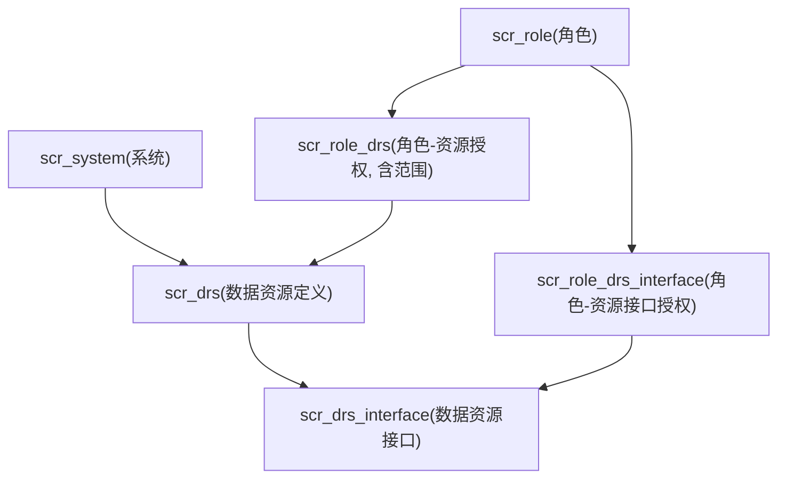

# 数据资源上手指南

> 适用范围：`Refinex-Platform` 当前版本（`refinex-system` + `refinex-auth`）。
>
> 文档目标：说明 `scr_drs` / `scr_drs_interface` 的设计思路、和 RBAC 的关系、以及如何落地使用。

## 1. 设计思路：为什么要有 `scr_drs` 和 `scr_drs_interface`

`scr_menu` / `scr_menu_op` 主要解决 “前台功能入口与按钮权限”，但很多场景不完全对应菜单，例如：

- 内部 API（无页面入口）
- 数据导入导出
- 文件访问
- 业务集合或资源域级权限

所以引入 “数据资源模型”，把权限从 “页面行为” 扩展到 “资源访问”。

核心分层如下：

- `scr_drs`：资源目录层（描述一个资源域）
- `scr_drs_interface`：资源接口层（描述可执行访问点）

可以把它理解成：

- `scr_drs` 负责 “这是什么资源”
- `scr_drs_interface` 负责 “这个资源的哪个接口可访问、对应什么权限码”

## 2. 模型关系与职责



各表职责：

- `scr_drs`
    - 资源主档：`drs_code`、`drs_type`、`resource_uri`、`owner_estab_id`、`data_owner_type`
    - 资源归属和资源边界定义
- `scr_drs_interface`
    - 资源接口：`interface_code`、`http_method`、`path_pattern`、`permission_key`
    - 细粒度授权入口
- `scr_role_drs`
    - 角色到资源域的授权 + 数据范围（`scope_type`、`scope_rule`）
    - 用于 “能看哪些数据”
- `scr_role_drs_interface`
    - 角色到资源接口的授权
    - 用于 “能调哪些接口”

## 3. 在当前系统中的生效链路

登录后，`refinex-auth` 会聚合三类权限码：

- 菜单权限码（`scr_menu.permission_key`）
- 菜单操作权限码（`scr_menu_op.permission_key`）
- 数据资源接口权限码（`scr_drs_interface.permission_key`，通过 `scr_role_drs_interface` 关联）

对应查询位置：

-
`/Users/refinex/develop/code/refinex/Refinex-Platform/refinex-auth/src/main/java/cn/refinex/auth/infrastructure/mapper/AuthRbacMapper.java`

也就是说：`scr_drs_interface.permission_key` 已经进入登录态权限集合，可用于 Sa-Token 注解或网关/服务端鉴权。

## 4. 当前已落地能力

`refinex-system` 已提供数据资源管理 API（CRUD）：

- `GET /drs`
- `GET /drs/{drsId}`
- `POST /drs`
- `PUT /drs/{drsId}`
- `DELETE /drs/{drsId}`
- `GET /drs/interfaces?drsId=...`
- `GET /drs/interfaces/{interfaceId}`
- `POST /drs/{drsId}/interfaces`
- `PUT /drs/interfaces/{interfaceId}`
- `DELETE /drs/interfaces/{interfaceId}`

代码位置：

-
`/Users/refinex/develop/code/refinex/Refinex-Platform/refinex-business/refinex-system/src/main/java/cn/refinex/system/interfaces/controller/DataResourceController.java`

通过网关访问时：

- `/refinex-system/drs/**`

## 5. 上手步骤（推荐）

### 步骤 1：定义资源域（`scr_drs`）

示例：定义 “租户用户数据” 资源

```json
POST /refinex-system/drs
{
  "systemId": 2,
  "drsCode": "TENANT_USER_TABLE",
  "drsName": "租户用户数据",
  "drsType": 0,
  "resourceUri": "def_user",
  "ownerEstabId": 1,
  "dataOwnerType": 1,
  "status": 1,
  "remark": "租户用户主档"
}
```

### 步骤 2：定义资源接口（`scr_drs_interface`）

示例：定义 “查看当前用户资料” 接口

```json
POST /refinex-system/drs/{
  drsId
}/interfaces
{
  "interfaceCode": "USER_PROFILE_VIEW",
  "interfaceName": "查看用户资料",
  "httpMethod": "GET",
  "pathPattern": "/users/me/profile",
  "permissionKey": "tenant:user:profile:view",
  "status": 1,
  "sort": 10
}
```

### 步骤 3：授权到角色

当前版本建议通过 SQL 管理（后续可补系统接口）：

```sql
-- 角色授权资源接口（决定有无接口权限码）
INSERT INTO scr_role_drs_interface(role_id, drs_interface_id, create_by, update_by, deleted, lock_version)
VALUES (?, ?, 1, 1, 0, 0);

-- 角色授权资源范围（决定数据范围）
INSERT INTO scr_role_drs(role_id, drs_id, scope_type, scope_rule, create_by, update_by, deleted, lock_version)
VALUES (?, ?, 1, JSON_OBJECT('field', 'id', 'operator', '=', 'valueFrom', 'loginUserId'), 1, 1, 0, 0);
```

`scope_type` 建议：

- `0`：全部
- `1`：本人
- `2`：团队/部门
- `3`：自定义（配合 `scope_rule`）

### 步骤 4：服务接口做权限校验

在业务接口上使用权限码：

- 例如：`tenant:user:profile:view`

这样登录态中如果包含该权限码即可放行。

### 步骤 5：数据层做范围过滤

`scr_role_drs.scope_type/scope_rule` 不应只停留在配置层，最终要落到查询条件中。

建议：

- 应用服务层解析当前用户角色的资源范围
- 仓储查询时追加 where 条件（本人/部门/自定义规则）

## 6. 关键字段建议

- `drs_code`：稳定、不随展示名变化，推荐大写下划线
- `resource_uri`：资源定位，表名/URI/路径都可，但保持全局规范
- `path_pattern`：用于接口维度匹配，建议和网关路由风格一致
- `permission_key`：与菜单权限统一命名体系，避免两套规范
- `owner_estab_id + data_owner_type`：用于多租户隔离语义表达

## 7. 常见误区

- 只建 `scr_drs` 不建 `scr_drs_interface`：无法形成可校验的接口权限码
- 只做接口授权不做范围过滤：会“能进接口但越权看数据”
- `permission_key` 和菜单权限命名割裂：后期治理成本很高
- 把 `resource_uri` 当展示字段：它应是稳定的技术标识

## 8. 与当前代码状态的对应结论

- 已完成：
    - `scr_drs` / `scr_drs_interface` 的管理能力
    - `scr_drs_interface.permission_key` 纳入登录态权限聚合
- 待完善（建议下一阶段）：
    - `scr_role_drs` / `scr_role_drs_interface` 的系统管理接口
    - 数据范围规则解析器（`scope_rule` -> 查询条件）
    - 一套统一的资源权限命名与治理规范

