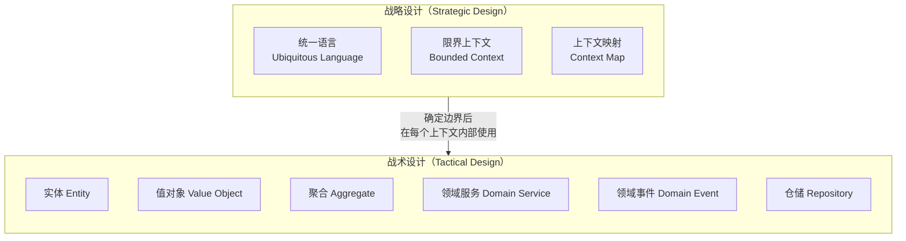
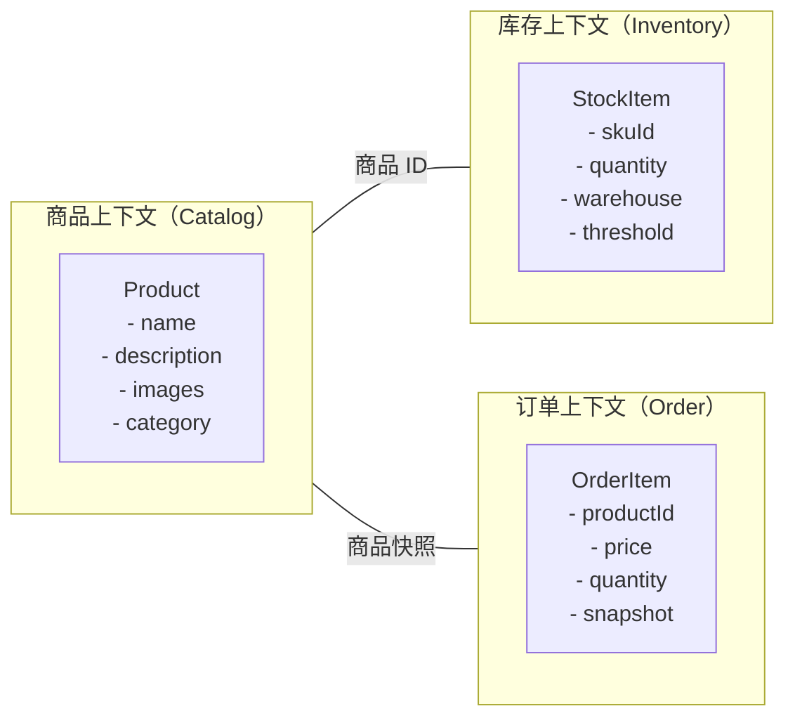
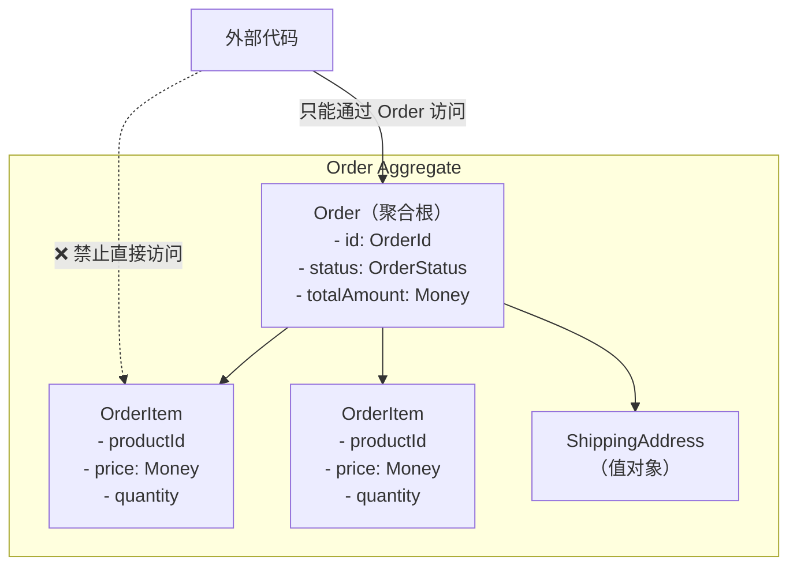
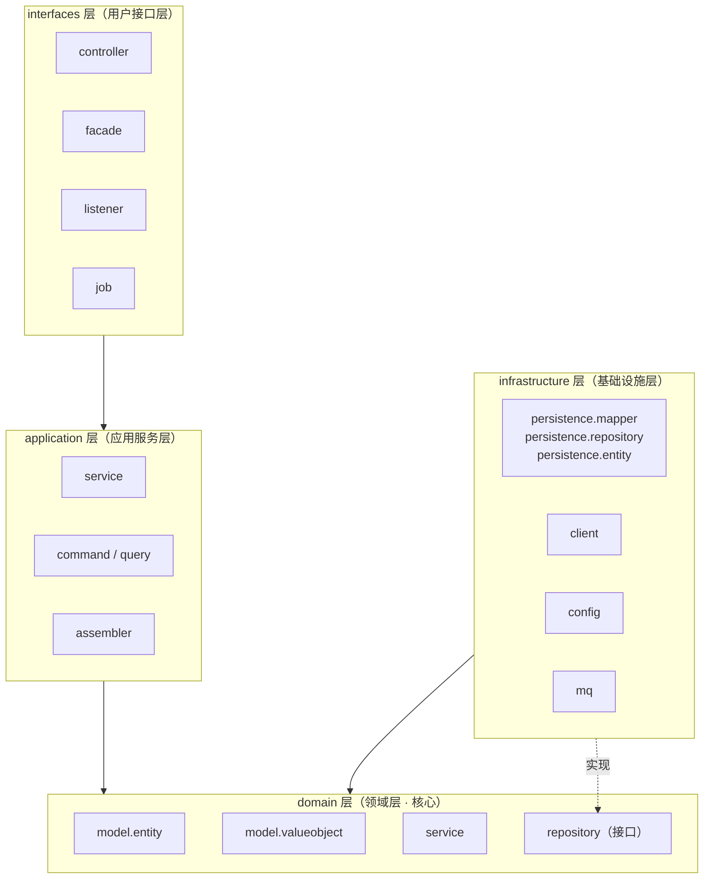
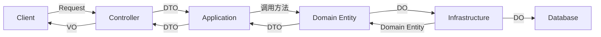
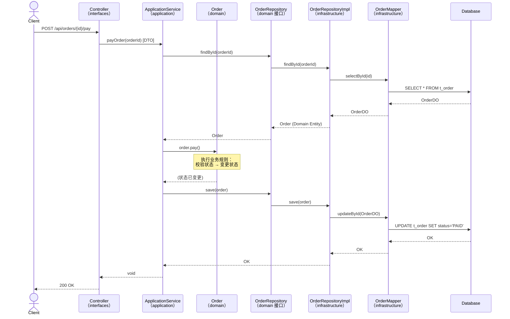
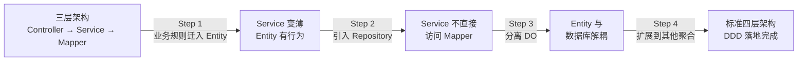

# 领域驱动设计（DDD）：从核心概念到 Spring Cloud 标准落地

> 
> 
> - 适用读者：有 Spring Boot / Spring Cloud 微服务开发经验，希望系统掌握 DDD 并在项目中规范落地的 Java 开发者。
> - 技术栈基线：Java 21 + Spring Boot 4.x + Spring Framework 7.x + Spring Cloud 2025.x。
> - 文档校准时间：2026-02-18。

## 0. 这篇文章要解决什么问题

大多数 Spring Cloud 项目在初期都采用 "Controller → Service → Mapper" 三层架构。业务简单时运转良好，但随着需求膨胀，几乎所有团队都会遇到同一组症状：

- **Service 类膨胀到数千行**，一个 `OrderService` 里混杂着下单、支付、退款、库存扣减、优惠计算、消息推送……
- **业务规则散落在各处**：Controller 里有参数校验夹带业务判断，Service 里有，甚至 SQL 里也有。改一条规则要翻三层代码。
- **对象定义混乱**：同一个 `Order` 类既当请求参数、又当数据库映射、又当接口返回值。字段越加越多，谁也说不清哪些字段在哪个场景下有意义。
- **测试困难**：Service 直接依赖数据库、Redis、HTTP 调用，单元测试要么不写、要么全靠集成环境。

这些问题的根源不是代码写得不好，而是 **缺乏一套系统的方法来管理业务复杂性**。

领域驱动设计（Domain-Driven Design，DDD）正是为解决这类问题而生的方法论。Eric Evans 在 2003 年出版的 *"Domain-Driven Design: Tackling Complexity in the Heart of Software"* 中首次系统化地提出了这套思想。它的核心主张很直接：**软件的首要复杂性来自业务本身，而非技术实现。因此，软件架构应该围绕业务领域来组织，而不是围绕技术框架来组织。**

本文的目标是：帮你从概念层面真正理解 DDD 的核心思想，然后落到一套可在 Spring Cloud 项目中直接执行的标准分层架构——包括代码结构、依赖规则、数据对象边界、完整实战示例。

## 1. DDD 的核心思想：把业务放回代码的中心

### 1.1 传统三层架构的根本问题

先看典型的三层架构代码：

```java
// 传统三层架构中的 "贫血模型" 示例
// Order 只是一个数据容器——纯粹的 getter/setter，没有任何业务行为
public class Order {
    private Long id;
    private String status;
    private BigDecimal totalAmount;
    // ... 20 个 getter/setter
}
```

```java
// 所有业务逻辑都堆在 Service 里
// 随着业务增长，这个类会膨胀到不可维护的程度
@Service
public class OrderService {

    @Autowired
    private OrderMapper orderMapper;
    @Autowired
    private InventoryMapper inventoryMapper;
    @Autowired
    private CouponMapper couponMapper;
    @Autowired
    private PaymentClient paymentClient;
    @Autowired
    private MessageClient messageClient;

    @Transactional
    public void pay(Long orderId) {
        Order order = orderMapper.selectById(orderId);

        // 业务规则 1：状态校验
        if (!"CREATED".equals(order.getStatus())) {
            throw new RuntimeException("订单状态不允许支付");
        }

        // 业务规则 2：库存检查
        Inventory inventory = inventoryMapper.selectBySkuId(order.getSkuId());
        if (inventory.getStock() < order.getQuantity()) {
            throw new RuntimeException("库存不足");
        }

        // 业务规则 3：优惠计算
        Coupon coupon = couponMapper.selectById(order.getCouponId());
        if (coupon != null && coupon.isValid()) {
            order.setTotalAmount(order.getTotalAmount().subtract(coupon.getDiscount()));
        }

        // 业务规则 4：调用支付
        paymentClient.charge(order.getId(), order.getTotalAmount());

        // 业务规则 5：更新状态
        order.setStatus("PAID");
        orderMapper.updateById(order);

        // 业务规则 6：发消息
        messageClient.send("order.paid", order.getId());
    }

    // ... 还有 createOrder(), cancelOrder(), refundOrder() 等十几个方法
    // 每个方法都是类似的 "面条式" 流程
}
```

这段代码的问题不在于它 "不能工作"，而在于：

1. **业务规则隐藏在技术细节中**。"订单只有 CREATED 状态才能支付" 这条核心规则，被埋在数据库查询、HTTP 调用、事务管理等技术操作之间。新人要理解支付规则，必须读懂整个方法。
2. **`Order` 对象没有自我保护能力**。任何人都可以在任何地方 `order.setStatus("PAID")` ——绕过所有业务校验。
3. **Service 承担了太多职责**。编排流程、执行业务规则、访问数据库、调用远程服务、发消息……全在一个类里。

Martin Fowler 把这种模式称为 **贫血领域模型（Anemic Domain Model）**，并明确指出这是一种反模式。

### 1.2 DDD 的回答：让领域对象 "活" 起来

DDD 的核心转变可以用一句话概括：**业务规则应该由领域对象自己执行，而不是由外部的 Service 代劳。**

同样是 "订单支付" 这个场景，DDD 的写法是：

```java
// DDD 中的 "充血模型" 示例
// Order 不再是被动的数据容器，它主动执行和保护自己的业务规则
public class Order {

    private OrderId id;           // 使用值对象而非原始类型
    private OrderStatus status;   // 枚举，不是字符串
    private Money totalAmount;    // 值对象，封装金额计算逻辑

    /**
     * 订单支付：核心业务规则由 Order 自己守护
     * - 只有 CREATED 状态的订单才能进入支付流程
     * - 状态转换是原子性的，外部无法绕过校验直接改状态
     */
    public void pay() {
        if (this.status != OrderStatus.CREATED) {
            throw new OrderStatusException(
                "订单 " + id.getValue() + " 当前状态为 " + status + "，无法支付"
            );
        }
        this.status = OrderStatus.PAID;
        // 注意：这里只处理 Order 自身的状态变更
        // 调用支付网关、扣库存、发消息等 "编排" 工作不在这里
    }

    /**
     * 应用优惠券：金额计算规则也由 Order 自己负责
     */
    public void applyCoupon(Coupon coupon) {
        if (!coupon.isValid()) {
            throw new CouponExpiredException("优惠券已过期");
        }
        this.totalAmount = this.totalAmount.subtract(coupon.getDiscount());
    }
}
```

对比两种写法，关键差异在于：

| 维度 | 贫血模型 | 充血模型（DDD） |
| --- | --- | --- |
| 业务规则位置 | 散落在 Service、Controller、SQL 中 | 集中在领域对象内部 |
| 对象角色 | 被动数据容器（getter/setter） | 具有行为的业务实体 |
| 状态保护 | 无保护，任何人可随意修改 | 只能通过领域方法改变状态 |
| 可测试性 | 依赖数据库、网络等基础设施 | 纯 Java 对象，可直接单测 |
| 新人理解成本 | 必须通读 Service 全部代码 | 看领域对象的方法签名即可 |

### 1.3 DDD 的两个设计层次

DDD 的方法论分为两个层次，解决不同尺度的问题：



- **战略设计**回答的是 "系统怎么拆" 的问题——如何划分业务边界、如何定义服务间的协作关系。
- **战术设计**回答的是 "代码怎么写" 的问题——在每个业务边界内部，如何组织领域模型。

接下来逐一展开。

## 2. 战略设计：先画地图，再建房子

战略设计是 DDD 中最被低估的部分。很多团队直接跳到 "写 Entity、写 Repository"，结果微服务边界划错，后续怎么改代码都别扭。

### 2.1 统一语言（Ubiquitous Language）

统一语言是 DDD 最基础也最重要的实践——它要求 **开发团队和业务团队使用完全一致的术语来描述业务概念**，这些术语直接体现在代码中。

一个典型的反面案例：

- 产品经理说 "客户下单"
- 开发者写 `UserService.createRecord()`
- 数据库表叫 `t_biz_data`

三方各说各话，沟通效率极低。

统一语言要求的是：如果业务上叫 "订单（Order）"，代码里就叫 `Order`；如果业务上说 "下单"，代码里就叫 `Order.place()` 或 `PlaceOrderCommand`。不搞技术黑话，不搞缩写。

这不仅仅是 "命名规范" 的问题。当团队真正用统一语言交流时，产品经理可以看懂领域模型的类图，开发者可以从需求文档直接推导出代码结构。**语言对齐是减少沟通损耗的最有效手段。**

### 2.2 限界上下文（Bounded Context）

限界上下文是 DDD 战略设计的核心概念。它的含义是：**同一个业务术语在不同的上下文中可以有不同的含义，每个上下文有自己独立的模型。**

以电商系统为例，"商品" 这个词在不同的业务场景下含义完全不同：



- 在 **商品上下文** 里，`Product` 关注的是名称、描述、图片、分类——面向用户展示。
- 在 **库存上下文** 里，同一个商品变成了 `StockItem`，关注的是 SKU、库存数量、仓库位置——面向供应链。
- 在 **订单上下文** 里，它变成了 `OrderItem`，关注的是购买时的价格快照、数量——面向交易。

如果试图用一个 `Product` 类覆盖所有场景，这个类会不断膨胀，各场景的字段互相干扰，最终变成一个 "上帝对象"。

**限界上下文的本质是：承认不同业务场景对同一事物有不同的理解，并用独立的模型来表达这些差异。** 每个限界上下文有自己的领域模型、自己的数据存储、自己的服务边界。

### 2.3 限界上下文与微服务的关系

一个常见的问题是：限界上下文和微服务是什么关系？

简短的回答：**一个限界上下文通常对应一个微服务，但不是绝对的。**

更准确的说法是：

- 限界上下文是 **业务边界**，由业务语义决定。
- 微服务是 **部署边界**，由技术和运维因素决定。
- 理想情况下两者对齐。但在实践中，一个限界上下文在早期可能作为一个模块存在于单体中，后续再拆为独立的微服务。反过来，一个微服务也可能因为业务过于简单而包含多个小的上下文。

关键原则是：**先用限界上下文划清业务边界，再决定部署策略。不要反过来——先决定 "我要拆 N 个微服务"，再硬凑业务边界。**

### 2.4 上下文映射（Context Map）

划定了限界上下文之后，下一个问题是：**不同上下文之间怎么协作？**

DDD 定义了几种常见的上下文间关系模式：

| 模式 | 含义 | 典型场景 |
| --- | --- | --- |
| **上游/下游（Upstream/Downstream）** | 上游提供能力，下游依赖上游的模型 | 商品上下文（上游）→ 订单上下文（下游） |
| **防腐层（Anti-Corruption Layer, ACL）** | 下游在自己一侧做模型转换，隔离上游变化 | 对接外部支付网关时，用 ACL 把外部模型转成内部模型 |
| **开放主机服务（Open Host Service）** | 上游提供标准化 API，多个下游共用 | 用户中心对外提供标准用户信息查询 API |
| **共享内核（Shared Kernel）** | 两个上下文共享一小部分模型 | 订单和支付共享 Money 值对象（需谨慎使用） |
| **发布语言（Published Language）** | 上下文间通过标准格式（如事件）通信 | 订单支付完成后发布 OrderPaidEvent，库存上下文订阅 |

在 Spring Cloud 微服务架构中，最常用的是 **防腐层** 和 **发布语言** 这两种模式。防腐层通过 infrastructure 层的 client 和 converter 实现；发布语言通过领域事件 + 消息队列实现。

## 3. 战术设计：领域模型的构造单元

战术设计定义了在一个限界上下文内部，如何用代码构建领域模型。下面逐个解析核心构造单元。

### 3.1 实体（Entity）

实体的核心特征是：**具有唯一标识（Identity），且标识在整个生命周期内不变。** 两个实体即使所有属性值都相同，只要 ID 不同，它们就是不同的实体。

```java
// Java 21 + DDD Entity 示例
// 注意：Entity 是纯 Java 对象，不依赖任何框架
public class Order {

    private final OrderId id;         // 唯一标识，创建后不可变
    private OrderStatus status;       // 状态由业务方法控制，没有 public setter
    private Money totalAmount;
    private CustomerId customerId;
    private List<OrderItem> items;
    private LocalDateTime createdAt;

    // 构造方法：创建订单时就执行初始业务规则
    public Order(OrderId id, CustomerId customerId, List<OrderItem> items) {
        if (items == null || items.isEmpty()) {
            throw new EmptyOrderException("订单至少包含一个商品");
        }
        this.id = id;
        this.customerId = customerId;
        this.items = List.copyOf(items); // 防御性拷贝
        this.status = OrderStatus.CREATED;
        this.totalAmount = calculateTotal(items);
        this.createdAt = LocalDateTime.now();
    }

    /**
     * 支付：状态转换规则由 Order 自己守护
     */
    public void pay() {
        if (this.status != OrderStatus.CREATED) {
            throw new OrderStatusException("只有待支付订单才能执行支付");
        }
        this.status = OrderStatus.PAID;
    }

    /**
     * 取消：已支付的订单不能直接取消，需要走退款流程
     */
    public void cancel() {
        if (this.status == OrderStatus.PAID) {
            throw new OrderStatusException("已支付订单请走退款流程");
        }
        if (this.status == OrderStatus.CANCELLED) {
            throw new OrderStatusException("订单已取消，请勿重复操作");
        }
        this.status = OrderStatus.CANCELLED;
    }

    // ---- 只暴露只读访问，没有 setter ----

    public OrderId getId() { return id; }
    public OrderStatus getStatus() { return status; }
    public Money getTotalAmount() { return totalAmount; }

    // 相等性基于 ID，不是属性
    @Override
    public boolean equals(Object o) {
        if (this == o) return true;
        if (!(o instanceof Order order)) return false;
        return id.equals(order.id);
    }

    @Override
    public int hashCode() {
        return id.hashCode();
    }

    private Money calculateTotal(List<OrderItem> items) {
        return items.stream()
                .map(OrderItem::subtotal)
                .reduce(Money.ZERO, Money::add);
    }
}
```

Entity 的关键设计原则：

1. **没有 public setter**。状态变更只能通过有业务含义的方法（`pay()`、`cancel()`），而不是 `setStatus()`。
2. **构造方法执行初始校验**。创建对象时就保证它处于合法状态。
3. **相等性基于 ID**。`equals()` 和 `hashCode()` 只看标识字段。
4. **不依赖任何框架**。没有 `@Entity`、`@Table`、`@Autowired`。纯 Java。

### 3.2 值对象（Value Object）

值对象的核心特征是：**没有唯一标识，完全由属性值定义。两个属性值相同的值对象就是同一个东西。** 值对象一旦创建就不可变。

```java
// 值对象示例：Money（金额）
// 不可变、无 ID、相等性基于全部属性值
public record Money(BigDecimal amount, Currency currency) {

    public static final Money ZERO = new Money(BigDecimal.ZERO, Currency.CNY);

    // 紧凑构造方法：在 record 创建时执行校验
    public Money {
        if (amount == null) {
            throw new IllegalArgumentException("金额不能为空");
        }
        if (amount.scale() > 2) {
            throw new IllegalArgumentException("金额精度不能超过两位小数");
        }
        if (currency == null) {
            throw new IllegalArgumentException("币种不能为空");
        }
    }

    public Money add(Money other) {
        ensureSameCurrency(other);
        return new Money(this.amount.add(other.amount), this.currency);
    }

    public Money subtract(Money other) {
        ensureSameCurrency(other);
        BigDecimal result = this.amount.subtract(other.amount);
        if (result.compareTo(BigDecimal.ZERO) < 0) {
            throw new NegativeAmountException("计算结果为负数");
        }
        return new Money(result, this.currency);
    }

    private void ensureSameCurrency(Money other) {
        if (this.currency != other.currency) {
            throw new CurrencyMismatchException(
                "币种不一致: " + this.currency + " vs " + other.currency
            );
        }
    }
}
```

```java
// 值对象示例：Address（地址）
public record Address(
    String province,
    String city,
    String district,
    String street,
    String zipCode
) {
    public Address {
        if (province == null || province.isBlank()) {
            throw new IllegalArgumentException("省份不能为空");
        }
        if (city == null || city.isBlank()) {
            throw new IllegalArgumentException("城市不能为空");
        }
    }

    public String fullAddress() {
        return province + city + district + street;
    }
}
```

**什么时候用值对象而不是原始类型？** 当一个概念具有以下任何特征时：

- 它有自己的校验规则（金额不能为负、邮箱必须符合格式）
- 它有自己的行为（金额相加要校验币种、地址要拼接完整格式）
- 它由多个属性组合而成（地址 = 省 + 市 + 区 + 街道）
- 把它换成另一个同值实例不影响业务语义

用值对象替代原始类型（`String`、`Long`、`BigDecimal`）是提升代码表达力和安全性最立竿见影的做法。比如 `OrderId` 和 `CustomerId` 虽然底层都是 `Long`，但类型不同就不会被混用——编译器帮你挡住了一类错误。

### 3.3 聚合（Aggregate）与聚合根（Aggregate Root）

聚合是 DDD 中最难理解但最关键的概念之一。

**聚合是一组紧密关联的实体和值对象的集合，由一个聚合根（Aggregate Root）统一管理。外部只能通过聚合根来访问和修改聚合内部的对象。**

用现实世界类比：一个 "订单" 聚合包含 `Order`（聚合根）和 `OrderItem`（子实体）。你不会单独去修改某个 `OrderItem` 的价格——你得通过 `Order` 来操作，因为修改订单项可能影响总金额、影响优惠规则。`Order` 作为聚合根，负责保证整个聚合的一致性。



聚合的设计规则：

1. **聚合根是唯一入口**。外部代码只能持有聚合根的引用，不能直接操作子实体。
2. **聚合是事务一致性边界**。一个事务只修改一个聚合。如果一个操作需要修改多个聚合，通过领域事件实现最终一致性。
3. **聚合间通过 ID 引用**。`Order` 不直接持有 `Customer` 对象，而是持有 `CustomerId`。这避免了聚合之间的强耦合。
4. **聚合要尽量小**。只包含必须在同一事务中保持一致的对象。

```java
// 聚合根设计示例：Order 管理其下的 OrderItem
public class Order {

    private final OrderId id;
    private OrderStatus status;
    private Money totalAmount;
    private CustomerId customerId;           // 跨聚合引用用 ID，不是对象
    private List<OrderItem> items;           // 聚合内部的子实体
    private ShippingAddress shippingAddress; // 聚合内部的值对象

    /**
     * 添加商品项：由聚合根统一管理，保证总金额一致性
     */
    public void addItem(OrderItem item) {
        if (this.status != OrderStatus.CREATED) {
            throw new OrderStatusException("只有待支付订单才能修改商品");
        }
        this.items.add(item);
        this.totalAmount = calculateTotal(this.items);
    }

    /**
     * 移除商品项：同样由聚合根统一管理
     */
    public void removeItem(ProductId productId) {
        if (this.status != OrderStatus.CREATED) {
            throw new OrderStatusException("只有待支付订单才能修改商品");
        }
        this.items.removeIf(item -> item.getProductId().equals(productId));
        if (this.items.isEmpty()) {
            throw new EmptyOrderException("订单至少包含一个商品");
        }
        this.totalAmount = calculateTotal(this.items);
    }

    // ... 省略其他方法

    private Money calculateTotal(List<OrderItem> items) {
        return items.stream()
                .map(OrderItem::subtotal)
                .reduce(Money.ZERO, Money::add);
    }
}
```

### 3.4 领域服务（Domain Service）

当一个业务操作不自然地属于任何一个实体时，它应该放在领域服务中。

判断标准很简单：**如果一个操作需要协调多个聚合或依赖外部策略，但它本身是一条领域规则（不是技术编排），就放在 Domain Service。**

```java
// 领域服务示例：跨聚合的库存校验
// 注意：Domain Service 也是纯 Java，不依赖 Spring
public class InventoryCheckService {

    /**
     * 检查订单中所有商品的库存是否充足
     * 这个操作涉及 Order 和 Inventory 两个聚合，不适合放在任何一个实体中
     */
    public void checkInventory(Order order, List<InventoryItem> inventoryItems) {
        for (OrderItem orderItem : order.getItems()) {
            InventoryItem stock = inventoryItems.stream()
                    .filter(inv -> inv.getSkuId().equals(orderItem.getSkuId()))
                    .findFirst()
                    .orElseThrow(() -> new InventoryNotFoundException(
                        "商品 " + orderItem.getSkuId() + " 未找到库存记录"
                    ));

            if (stock.getAvailable() < orderItem.getQuantity()) {
                throw new InsufficientInventoryException(
                    "商品 " + orderItem.getSkuId() + " 库存不足: " +
                    "需要 " + orderItem.getQuantity() + "，可用 " + stock.getAvailable()
                );
            }
        }
    }
}
```

**常见误区：把所有逻辑都塞进 Domain Service。** 如果一个操作明确属于某个实体（比如 "订单支付"），它应该是实体的方法，不是 Domain Service 的方法。Domain Service 是补充，不是替代。

### 3.5 领域事件（Domain Event）

领域事件表示 **领域中发生的、其他部分可能关心的事实**。它用过去时命名，比如 `OrderPaidEvent`（订单已支付）、`InventoryDeductedEvent`（库存已扣减）。

领域事件的核心价值在于 **解耦聚合间的协作**。回顾前面的例子：订单支付后需要扣库存、发通知。如果在 `Order.pay()` 里直接调用库存服务和消息服务，`Order` 就和这些外部概念耦合了。用领域事件，`Order` 只需要 "宣布" 自己被支付了，至于谁来监听、做什么响应，`Order` 不关心。

```java
// 领域事件：描述 "已经发生的事实"
// 不可变，过去时命名
public record OrderPaidEvent(
    OrderId orderId,
    CustomerId customerId,
    Money amount,
    LocalDateTime occurredAt
) {
    public OrderPaidEvent {
        if (orderId == null) throw new IllegalArgumentException("orderId 不能为空");
        if (amount == null) throw new IllegalArgumentException("amount 不能为空");
    }
}
```

```java
// 在 Entity 中生产事件
public class Order {

    private final List<Object> domainEvents = new ArrayList<>();

    public void pay() {
        if (this.status != OrderStatus.CREATED) {
            throw new OrderStatusException("只有待支付订单才能执行支付");
        }
        this.status = OrderStatus.PAID;

        // 记录领域事件——"我被支付了"
        // 事件的发布和处理不在这里，由 Application 层或 Infrastructure 层负责
        this.domainEvents.add(new OrderPaidEvent(
            this.id, this.customerId, this.totalAmount, LocalDateTime.now()
        ));
    }

    public List<Object> getDomainEvents() {
        return List.copyOf(domainEvents);
    }

    public void clearDomainEvents() {
        domainEvents.clear();
    }
}
```

### 3.6 仓储（Repository）

仓储的职责是 **提供聚合的持久化和检索能力，但以领域的语言来表达，而不是数据库的语言**。

关键设计：**仓储接口定义在 domain 层，实现放在 infrastructure 层。** 这样领域模型只依赖接口，不知道数据到底存在 MySQL、MongoDB 还是内存里。

```java
// domain 层：仓储接口
// 只用领域语言描述操作，不暴露任何数据库细节
public interface OrderRepository {

    /**
     * 根据 ID 查找订单聚合
     * 返回 Optional 而非 null，让调用方显式处理 "不存在" 的情况
     */
    Optional<Order> findById(OrderId id);

    /**
     * 保存（新建或更新）一个订单聚合
     */
    void save(Order order);

    /**
     * 根据客户 ID 查找该客户的所有订单
     */
    List<Order> findByCustomerId(CustomerId customerId);
}
```

注意仓储接口里没有 `selectByXxx`、`updateById`、`insertBatch` 这种数据库术语。它用的是 `findById`、`save` 这种领域语言。

## 4. 四层架构：DDD 在 Spring Cloud 项目中的标准落地

理解了 DDD 的核心概念后，关键问题来了：**这些东西在 Spring Boot / Spring Cloud 项目中怎么组织？代码应该放在哪里？层与层之间的依赖规则是什么？**

本节定义一套严格的四层架构标准，直接对齐 DDD 的设计理念。

### 4.1 四层总览



依赖方向规则（这是铁律，没有例外）：

```
interfaces → application → domain
infrastructure → domain
```

禁止方向（违反任何一条都是架构错误）：

```
domain → application          ❌
domain → interfaces           ❌
domain → infrastructure       ❌
application → interfaces      ❌
application → mapper          ❌
interfaces → mapper           ❌
interfaces → repository impl  ❌
```

### 4.2 interfaces 层：接收请求，返回结果

**职责边界**：接收外部输入（HTTP 请求、消息监听、定时任务），做参数校验，调用 application 层，返回 VO。

**绝对不做**：业务逻辑、数据库访问、远程调用。

```
com.example.order
└── interfaces
    ├── controller
    │   └── OrderController.java
    ├── facade
    │   └── OrderFacade.java        // 聚合多个 application service 的门面（BFF 场景）
    ├── listener
    │   └── OrderEventListener.java // MQ 消息监听入口
    ├── job
    │   └── OrderTimeoutJob.java    // 定时任务入口
    └── vo
        ├── OrderVO.java            // 返回给前端的视图对象
        └── CreateOrderRequest.java // 接收前端的请求对象
```

```java
// interfaces 层示例：只做 "接-转-回"
@RestController
@RequestMapping("/api/orders")
public class OrderController {

    private final OrderApplicationService orderService;
    private final OrderVOAssembler voAssembler;

    public OrderController(OrderApplicationService orderService, OrderVOAssembler voAssembler) {
        this.orderService = orderService;
        this.voAssembler = voAssembler;
    }

    @PostMapping
    public Result<OrderVO> createOrder(@RequestBody @Valid CreateOrderRequest request) {
        // 1. 把 Request 转成 DTO（或直接传 Request，取决于团队约定）
        // 2. 调用 application 层
        OrderDTO dto = orderService.createOrder(request.toDTO());
        // 3. 把 DTO 转成 VO 返回
        return Result.success(voAssembler.toVO(dto));
    }

    @PostMapping("/{orderId}/pay")
    public Result<Void> pay(@PathVariable Long orderId) {
        orderService.payOrder(orderId);
        return Result.success();
    }
}
```

### 4.3 application 层：编排流程，管理事务

**职责边界**：编排业务流程（调用领域对象和仓储）、管理事务、DTO 与 Domain 之间的对象转换。

**绝对不做**：直接访问数据库（Mapper）、直接调用 HTTP 客户端、直接操作 Redis/MQ。这些都是 infrastructure 层的事。

```
com.example.order
└── application
    ├── service
    │   └── OrderApplicationService.java
    ├── command
    │   └── CreateOrderCommand.java
    ├── query
    │   └── OrderQuery.java
    ├── dto
    │   ├── OrderDTO.java
    │   └── CreateOrderDTO.java
    └── assembler
        └── OrderAssembler.java     // MapStruct: DTO ↔ Domain
```

```java
// application 层示例：编排流程，不实现业务规则
@Service
public class OrderApplicationService {

    private final OrderRepository orderRepository;             // domain 层接口
    private final InventoryRepository inventoryRepository;
    private final InventoryCheckService inventoryCheckService; // domain 层服务
    private final OrderAssembler assembler;                    // MapStruct

    public OrderApplicationService(OrderRepository orderRepository,
                                   InventoryRepository inventoryRepository,
                                   InventoryCheckService inventoryCheckService,
                                   OrderAssembler assembler) {
        this.orderRepository = orderRepository;
        this.inventoryRepository = inventoryRepository;
        this.inventoryCheckService = inventoryCheckService;
        this.assembler = assembler;
    }

    /**
     * 创建订单：编排流程，但业务规则由 Domain 执行
     */
    @Transactional
    public OrderDTO createOrder(CreateOrderDTO dto) {
        // 1. DTO → Domain（通过 MapStruct）
        Order order = assembler.toDomain(dto);

        // 2. 调用 Domain Service 做库存校验（跨聚合的业务规则）
        List<InventoryItem> inventoryItems = inventoryRepository.findBySkuIds(order.getSkuIds());
        inventoryCheckService.checkInventory(order, inventoryItems);

        // 3. 通过 Repository 保存聚合
        orderRepository.save(order);

        // 4. Domain → DTO 返回
        return assembler.toDTO(order);
    }

    /**
     * 支付订单
     */
    @Transactional
    public void payOrder(Long orderId) {
        // 1. 从仓储加载聚合
        Order order = orderRepository.findById(new OrderId(orderId))
                .orElseThrow(() -> new OrderNotFoundException("订单不存在: " + orderId));

        // 2. 调用聚合根的业务方法——业务规则由 Order 自己执行
        order.pay();

        // 3. 保存变更
        orderRepository.save(order);

        // 4. 处理领域事件（实际项目中通常由事件发布器统一处理）
        // eventPublisher.publishAll(order.getDomainEvents());
        // order.clearDomainEvents();
    }
}
```

注意 `@Transactional` 只出现在 application 层。不在 Controller，不在 Domain，不在 Repository，不在 Mapper。

### 4.4 domain 层：纯业务，零依赖

**职责边界**：包含所有业务规则、领域模型、领域服务、仓储接口。

**最高优先级规则：domain 层必须是 Pure Java，不依赖任何框架。**

```
com.example.order
└── domain
    ├── model
    │   ├── entity
    │   │   ├── Order.java           // 聚合根
    │   │   └── OrderItem.java       // 子实体
    │   └── valueobject
    │       ├── OrderId.java
    │       ├── OrderStatus.java
    │       └── Money.java
    ├── repository
    │   └── OrderRepository.java     // 仓储接口（只有接口）
    ├── service
    │   └── InventoryCheckService.java
    └── event
        └── OrderPaidEvent.java
```

domain 层的代码在前面的章节已经展示过。这里强调一个检查清单——如果你的 domain 层代码中出现了以下任何一项，就是架构违规：

- `import org.springframework.*`
- `import com.baomidou.mybatisplus.*`
- `@Autowired`、`@Service`、`@Component`
- `@Table`、`@TableName`、`@Column`
- 任何数据库、HTTP、Redis、MQ 相关的类

**domain 层的测试可以完全脱离 Spring 容器运行**——这是判断它是否 "纯净" 的终极标准。

```java
// domain 层单元测试：纯 Java，无需启动 Spring
class OrderTest {

    @Test
    void should_pay_order_when_status_is_created() {
        Order order = new Order(
            new OrderId(1L),
            new CustomerId(100L),
            List.of(new OrderItem(new ProductId(1L), Money.of(99), 2))
        );

        order.pay();

        assertEquals(OrderStatus.PAID, order.getStatus());
    }

    @Test
    void should_reject_payment_when_status_is_not_created() {
        Order order = createPaidOrder();

        assertThrows(OrderStatusException.class, order::pay);
    }
}
```

### 4.5 infrastructure 层：技术实现，服务领域

**职责边界**：实现 domain 层定义的仓储接口、数据库访问（MyBatis Plus Mapper）、HTTP 远程调用（Spring HTTP Service Client）、消息队列、缓存、配置。

```
com.example.order
└── infrastructure
    ├── persistence
    │   ├── mapper
    │   │   └── OrderMapper.java         // MyBatis Plus Mapper
    │   ├── entity
    │   │   └── OrderDO.java             // 数据库映射对象
    │   ├── repository
    │   │   └── OrderRepositoryImpl.java // 实现 domain 的 OrderRepository
    │   └── converter
    │       └── OrderConverter.java      // MapStruct: Domain ↔ DO
    ├── client
    │   └── UserHttpClient.java          // Spring HTTP Service Client
    ├── config
    │   └── MyBatisPlusConfig.java
    └── mq
        └── OrderEventPublisher.java
```

```java
// infrastructure 层：仓储实现
// 这是唯一直接接触数据库的地方
@Repository
public class OrderRepositoryImpl implements OrderRepository {

    private final OrderMapper orderMapper;        // MyBatis Plus
    private final OrderItemMapper orderItemMapper;
    private final OrderConverter converter;        // MapStruct

    public OrderRepositoryImpl(OrderMapper orderMapper, OrderItemMapper orderItemMapper OrderConverter converter) {
        this.orderMapper = orderMapper;
        this.orderItemMapper = orderItemMapper;
        this.converter = converter;
    }

    @Override
    public Optional<Order> findById(OrderId id) {
        // 1. 用 Mapper 从数据库查询 DO
        OrderDO orderDO = orderMapper.selectById(id.getValue());
        if (orderDO == null) {
            return Optional.empty();
        }

        // 2. 查询关联的子实体
        List<OrderItemDO> itemDOs = orderItemMapper.selectByOrderId(id.getValue());

        // 3. DO → Domain Entity（通过 MapStruct）
        Order order = converter.toDomain(orderDO, itemDOs);
        return Optional.of(order);
    }

    @Override
    public void save(Order order) {
        // 1. Domain → DO
        OrderDO orderDO = converter.toDO(order);
        List<OrderItemDO> itemDOs = converter.toItemDOs(order.getItems());

        // 2. 持久化（insertOrUpdate 模式）
        orderMapper.insertOrUpdate(orderDO);

        // 3. 子实体：先删后插（简单策略，复杂场景可用 diff 策略）
        orderItemMapper.deleteByOrderId(order.getId().getValue());
        if (!itemDOs.isEmpty()) {
            orderItemMapper.insertBatch(itemDOs);
        }
    }

    @Override
    public List<Order> findByCustomerId(CustomerId customerId) {
        List<OrderDO> orderDOs = orderMapper.selectByCustomerId(customerId.getValue());
        return orderDOs.stream()
                .map(orderDO -> {
                    List<OrderItemDO> itemDOs = orderItemMapper.selectByOrderId(orderDO.getId());
                    return converter.toDomain(orderDO, itemDOs);
                })
                .toList();
    }
}
```

### 4.6 数据对象边界：VO / DTO / Entity / DO

四层架构中有四种数据对象，每种只在特定层使用，严禁混用：



| 对象类型 | 所属层 | 职责 | 示例 |
| --- | --- | --- | --- |
| **VO**（View Object） | interfaces | 返回给前端的展示数据，可以裁剪和组合 | `OrderVO`：只包含前端需要的字段 |
| **DTO**（Data Transfer Object） | application | 层间传输数据，承载 application 与 interfaces 的通信 | `CreateOrderDTO`、`OrderDTO` |
| **Entity**（领域实体） | domain | 领域模型，包含业务行为和规则 | `Order`、`OrderItem`、`Money` |
| **DO**（Data Object） | infrastructure | 数据库表映射，与表结构一一对应 | `OrderDO`：对应 `t_order` 表 |

### 4.7 对象转换：MapStruct 标准用法

对象转换使用 MapStruct，禁止使用 `BeanUtils.copyProperties` 或手写转换代码。

MapStruct 在编译期生成转换代码，类型安全且性能接近手写。位置规则：

- **application 层的 assembler**：负责 DTO ↔ Domain Entity 的转换
- **infrastructure 层的 converter**：负责 Domain Entity ↔ DO 的转换

```java
// application.assembler：DTO ↔ Domain
@Mapper(componentModel = "spring")
public interface OrderAssembler {

    @Mapping(target = "id", source = "orderId")
    @Mapping(target = "totalAmount", source = "order.totalAmount.amount")
    OrderDTO toDTO(Order order);

    @Mapping(target = "status", constant = "CREATED")
    Order toDomain(CreateOrderDTO dto);
}
```

```java
// infrastructure.converter：Domain ↔ DO
@Mapper(componentModel = "spring")
public interface OrderConverter {

    @Mapping(target = "id", source = "orderDO.id")
    @Mapping(target = "totalAmount", expression = "java(new Money(orderDO.getTotalAmount(), Currency.CNY))")
    Order toDomain(OrderDO orderDO, List<OrderItemDO> itemDOs);

    @Mapping(target = "totalAmount", source = "totalAmount.amount")
    OrderDO toDO(Order order);

    List<OrderItemDO> toItemDOs(List<OrderItem> items);
}
```

### 4.8 远程调用：infrastructure 层的 HTTP Service Client

跨服务调用（比如订单服务调用用户服务）属于 infrastructure 层的职责。使用 Spring HTTP Service Client，接口定义在 `infrastructure.client` 包下。

```java
// infrastructure.client：远程调用接口
// 使用 Spring HTTP Service Client（非 Feign）
@HttpExchange("/api/users")
public interface UserHttpClient {

    @GetExchange("/{id}")
    UserDTO getUser(@PathVariable Long id);
}
```

```java
// 在 infrastructure 的 repository 实现中使用远程调用
// 例如：OrderRepositoryImpl 需要查询用户信息来填充订单的某些字段
// 或者定义一个 Anti-Corruption Layer 来转换外部模型
@Component
public class UserGatewayImpl implements UserGateway {

    private final UserHttpClient userHttpClient;

    public UserGatewayImpl(UserHttpClient userHttpClient) {
        this.userHttpClient = userHttpClient;
    }

    @Override
    public UserInfo getUserInfo(CustomerId customerId) {
        UserDTO dto = userHttpClient.getUser(customerId.getValue());
        // 防腐层：把外部模型转成内部领域需要的模型
        return new UserInfo(dto.getName(), dto.getPhone());
    }
}
```

> 关于 Spring HTTP Service Client 的详细配置（分组注册、负载均衡、熔断降级、鉴权透传等），参见 [Spring HTTP Service Client 指南](https://www.notion.so/Spring-HTTP-Service-Client-30b4cb8807f280bfb8d9c4681c2d2442?pvs=21)。
> 

## 5. 完整调用流程图解

从一个 HTTP 请求进来，到数据库操作完成、响应返回，整个流程是这样的：



这张图清晰地展示了依赖方向：

- **interfaces → application → domain**（自上而下调用）
- **infrastructure → domain**（实现仓储接口）
- **domain 不依赖任何外层**（它不知道 Spring、MyBatis、HTTP 的存在）

## 6. 标准项目结构

以一个订单微服务为例，完整的包结构如下：

```
refinex-order-service/
├── pom.xml
└── src/main/java/com/refinex/order
    │
    ├── interfaces                          # 用户接口层
    │   ├── controller
    │   │   └── OrderController.java
    │   ├── facade
    │   │   └── OrderFacade.java
    │   ├── listener
    │   │   └── OrderEventListener.java
    │   ├── job
    │   │   └── OrderTimeoutJob.java
    │   └── vo
    │       ├── OrderVO.java
    │       └── CreateOrderRequest.java
    │
    ├── application                         # 应用服务层
    │   ├── service
    │   │   └── OrderApplicationService.java
    │   ├── command
    │   │   └── CreateOrderCommand.java
    │   ├── query
    │   │   └── OrderQuery.java
    │   ├── dto
    │   │   ├── OrderDTO.java
    │   │   └── CreateOrderDTO.java
    │   └── assembler
    │       └── OrderAssembler.java         # MapStruct: DTO ↔ Domain
    │
    ├── domain                              # 领域层（核心）
    │   ├── model
    │   │   ├── entity
    │   │   │   ├── Order.java              # 聚合根
    │   │   │   └── OrderItem.java
    │   │   └── valueobject
    │   │       ├── OrderId.java
    │   │       ├── OrderStatus.java
    │   │       └── Money.java
    │   ├── repository
    │   │   └── OrderRepository.java        # 仓储接口
    │   ├── service
    │   │   └── InventoryCheckService.java  # 领域服务
    │   └── event
    │       └── OrderPaidEvent.java
    │
    └── infrastructure                      # 基础设施层
        ├── persistence
        │   ├── mapper
        │   │   ├── OrderMapper.java        # MyBatis Plus
        │   │   └── OrderItemMapper.java
        │   ├── entity
        │   │   ├── OrderDO.java            # 数据库映射
        │   │   └── OrderItemDO.java
        │   ├── repository
        │   │   └── OrderRepositoryImpl.java
        │   └── converter
        │       └── OrderConverter.java     # MapStruct: Domain ↔ DO
        ├── client
        │   ├── UserHttpClient.java         # HTTP Service Client
        │   └── UserGatewayImpl.java        # 防腐层实现
        ├── config
        │   └── MyBatisPlusConfig.java
        └── mq
            └── OrderEventPublisher.java
```

## 7. 常见反模式与纠正

### 7.1 反模式：domain 层依赖 Spring

```java
// ❌ 严重违规：domain 层出现 Spring 注解
@Service  // 不应该出现
public class Order {

    @Autowired  // 不应该出现
    private OrderMapper mapper;

    public void pay() {
        // ...
        mapper.updateById(this);  // domain 直接访问数据库
    }
}
```

**纠正**：domain 层的对象都是纯 Java。持久化由 infrastructure 层的 Repository 实现负责。

### 7.2 反模式：application 层直接使用 Mapper

```java
// ❌ 违规：application 层绕过 Repository，直接用 Mapper
@Service
public class OrderApplicationService {

    @Autowired
    private OrderMapper orderMapper;  // 不应该直接注入 Mapper

    public void payOrder(Long orderId) {
        OrderDO orderDO = orderMapper.selectById(orderId);  // 直接操作 DO
        orderDO.setStatus("PAID");                          // 绕过业务规则
        orderMapper.updateById(orderDO);                    // 直接写库
    }
}
```

**纠正**：application 层只通过 domain 层的 Repository 接口获取聚合，调用聚合的业务方法，再通过 Repository 保存。

### 7.3 反模式：Controller 里做业务判断

```java
// ❌ 违规：interfaces 层包含业务逻辑
@PostMapping("/{orderId}/pay")
public Result<Void> pay(@PathVariable Long orderId) {
    OrderDTO order = orderService.getOrder(orderId);
    if (!"CREATED".equals(order.getStatus())) {       // 业务规则泄露到 Controller
        return Result.fail("订单状态不允许支付");
    }
    orderService.payOrder(orderId);
    return Result.success();
}
```

**纠正**：状态校验是业务规则，属于 domain 层 `Order.pay()` 的职责。Controller 只负责调用 `orderService.payOrder(orderId)`，由 domain 层抛出异常，全局异常处理器统一转换为错误响应。

### 7.4 反模式：聚合设计过大

```java
// ❌ 不推荐：Order 直接持有完整的 Customer 和 Product 对象
public class Order {
    private Customer customer;        // 不应该直接持有另一个聚合
    private List<Product> products;   // 不应该直接持有另一个聚合
}
```

**纠正**：聚合间通过 ID 引用。`Order` 持有 `CustomerId` 和 `ProductId`，需要用户信息时通过 application 层编排查询。

### 7.5 反模式：贫血的 "DDD"

```java
// ❌ 挂着 DDD 的名，做着贫血的事
// Entity 里只有 getter/setter，所有逻辑仍然在 Service 里
public class Order {
    private Long id;
    private String status;
    // ... 只有 getter/setter，没有任何业务方法
}

@Service
public class OrderDomainService {
    public void pay(Order order) {
        if (!"CREATED".equals(order.getStatus())) { ... }
        order.setStatus("PAID");  // 还是外部直接改状态
    }
}
```

**纠正**：如果一个操作的规则和数据都属于同一个实体，就应该是实体的方法。`pay()` 是 `Order` 自己的行为。

## 8. 事务规则

`@Transactional` 只允许出现在 **application 层的 service** 中。

| 位置 | 是否允许 | 原因 |
| --- | --- | --- |
| `application.service` | ✅ 允许 | Application 层负责编排用例，事务边界在这里最自然 |
| `interfaces.controller` | ❌ 禁止 | Controller 不应感知事务 |
| `domain.service` | ❌ 禁止 | Domain 不依赖 Spring（`@Transactional` 是 Spring 注解） |
| `infrastructure.persistence.repository` | ❌ 禁止 | Repository 实现不应自行管理事务，由上层控制 |
| `infrastructure.persistence.mapper` | ❌ 禁止 | Mapper 是最底层数据访问，不应感知事务 |

## 9. 什么时候用 DDD，什么时候不用

DDD 不是银弹。它有明确的适用场景和不适用场景。

### 适用场景

- **业务逻辑复杂、规则多变**：电商交易、金融风控、保险理赔等
- **多团队协作的中大型系统**：需要清晰的边界来降低沟通和协调成本
- **预期长期演进的系统**：业务规则会持续变化，需要可维护的架构
- **领域专家参与度高**：有业务方愿意和开发团队一起建模

### 不适用场景

- **纯 CRUD 系统**：管理后台、配置中心等，业务规则极少，三层架构足够
- **技术驱动型项目**：实时数据管道、基础中间件等，复杂性在技术而非业务
- **原型或短期项目**：快速验证想法时，DDD 的建模成本可能得不偿失
- **团队对 DDD 完全陌生且没有学习时间**：半吊子的 DDD 比不用 DDD 更糟糕

一个务实的建议：**在同一个微服务系统中，可以对核心业务域（交易、支付）采用 DDD 四层架构，对简单域（配置管理、日志查询）仍然用传统三层架构。** 不需要全系统一刀切。

## 10. 从贫血模型到 DDD 的渐进式迁移

如果你的项目已经是传统三层架构，不建议推倒重写。推荐分步迁移：

### 第一步：建立 domain 层，把核心业务规则迁入

从最核心的一个聚合开始（比如 `Order`）。把散落在 Service 中的业务规则，一条一条搬到 Entity 的方法里。同时去掉 Entity 上不合理的 setter。

### 第二步：引入 Repository 接口，隔离数据访问

在 domain 层定义 `OrderRepository` 接口，在 infrastructure 层实现它。把 application 层对 Mapper 的直接调用，改为通过 Repository 接口。

### 第三步：分离数据对象

引入 DO，让 domain 层的 Entity 不再承担数据库映射的职责。用 MapStruct 做 Entity ↔ DO 的转换。

### 第四步：逐步扩展到其他聚合

按业务优先级，逐个迁移其他聚合。每迁移一个，补充对应的单元测试。



每一步都可以独立发布上线，不需要一次性完成。

## 11. 架构合规检查清单

在 Code Review 或架构审查时，可以用这份清单逐项检查：

### domain 层纯净性

- [ ]  domain 层没有任何 `import org.springframework.*`
- [ ]  domain 层没有任何 `import com.baomidou.*`
- [ ]  Entity 没有 public setter，状态变更通过业务方法
- [ ]  Entity 的 `equals/hashCode` 基于 ID
- [ ]  值对象不可变（使用 `record` 或无 setter 的 final 字段）
- [ ]  Repository 只有接口在 domain 层，实现在 infrastructure 层

### 依赖方向

- [ ]  interfaces 只调用 application，不调用 domain 或 infrastructure
- [ ]  application 不直接使用 Mapper
- [ ]  application 不直接使用 HttpClient / Redis / MQ
- [ ]  domain 不依赖任何外层

### 对象边界

- [ ]  VO 只出现在 interfaces 层
- [ ]  DTO 只出现在 application 层
- [ ]  DO 只出现在 infrastructure 层
- [ ]  对象转换使用 MapStruct，没有 `BeanUtils.copyProperties`

### 事务管理

- [ ]  `@Transactional` 只出现在 `application.service`

### 远程调用

- [ ]  使用 Spring HTTP Service Client，不使用 Feign / RestTemplate
- [ ]  HTTP Client 接口定义在 `infrastructure.client`

## 12. 参考资料

1. Eric Evans. *Domain-Driven Design: Tackling Complexity in the Heart of Software*. Addison-Wesley, 2003.
2. Vaughn Vernon. *Implementing Domain-Driven Design*. Addison-Wesley, 2013.
3. Martin Fowler. *Anemic Domain Model*.[https://martinfowler.com/bliki/AnemicDomainModel.html](https://martinfowler.com/bliki/AnemicDomainModel.html)
4. Spring Framework 7 Reference - HTTP Interface Client.[https://docs.spring.io/spring-framework/reference/integration/rest-clients.html](https://docs.spring.io/spring-framework/reference/integration/rest-clients.html)
5. MapStruct Reference Guide.[https://mapstruct.org/documentation/stable/reference/html/](https://mapstruct.org/documentation/stable/reference/html/)